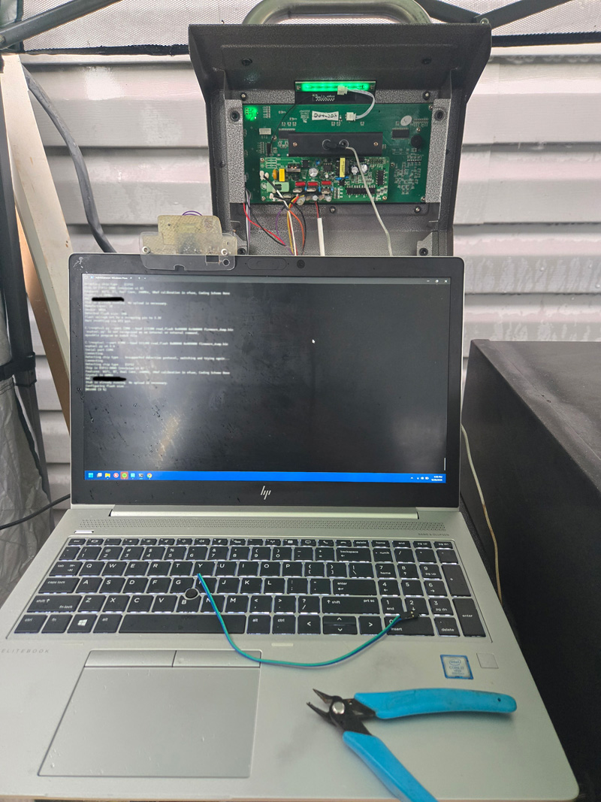
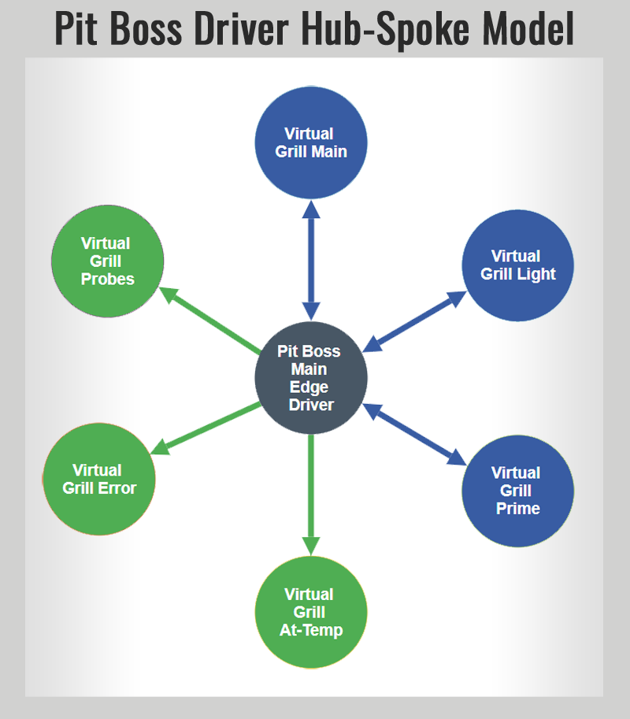
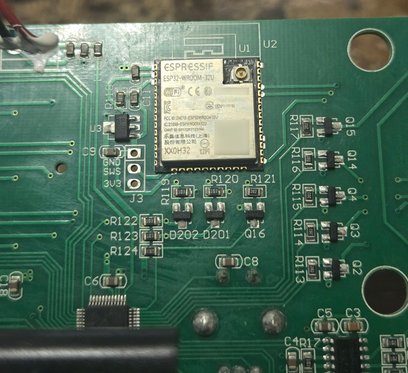
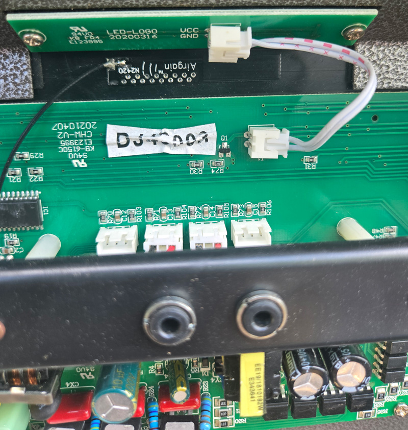
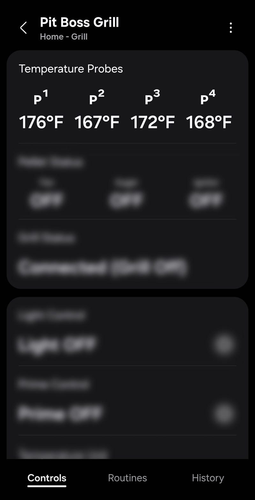
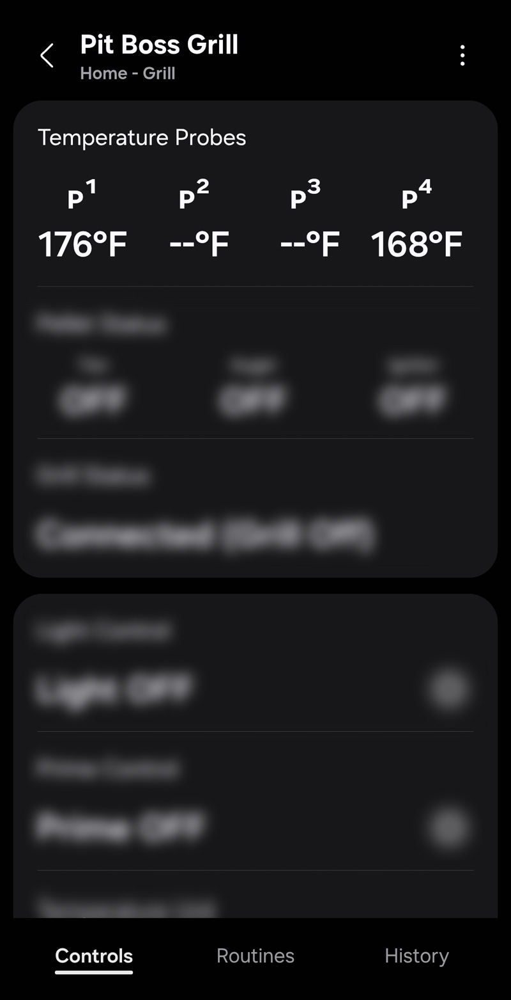

# Advanced Features Guide

This guide covers the technical implementation details, advanced functionality, and developer-oriented information about the Pit Boss grill driver.

> ⚠️ **Legal Notice**: This is unofficial third-party software developed through legitimate reverse engineering for interoperability. Pit Boss®, SmartThings®, and all mentioned trademarks are property of their respective owners. No proprietary source code was copied. Use at your own risk.

## Driver Architecture

### Core Components

The driver is built using the SmartThings Edge framework with these key components:

#### Main Driver Module

- **Language**: Lua 5.3 (SmartThings Edge runtime)
- **Framework**: SmartThings Edge SDK
- **Communication**: Time-based authenticated RPC calls over HTTP to the grill's ESP32 module (proprietary request/response fields with XOR-style stream mutation)
- **Threading**: Event-driven, non-blocking architecture using cosock
- **Memory Management**: Automatic garbage collection with intelligent caching

#### Device Capabilities

The driver implements both standard SmartThings capabilities and custom capabilities:

| Capability                      | Purpose                                                                      | Type     |
| ------------------------------- | ---------------------------------------------------------------------------- | -------- |
| **Switch**                      | Power on/off control                                                         | Standard |
| **Thermostat Heating Setpoint** | Target temperature control                                                   | Standard |
| **Temperature Measurement**     | Current temperature readings                                                 | Standard |
| **Refresh**                     | Manual status updates                                                        | Standard |
| **Panic Alarm**                 | Error state reporting                                                        | Standard |
| **grillTemp**                   | Enhanced temperature display with precision                                  | Custom   |
| **temperatureProbes**           | Unified display for all 4 probes with individual components for probes 1 & 2 | Custom   |
| **pelletStatus**                | Pellet system status                                                         | Custom   |
| **lightControl**                | Interior light control                                                       | Custom   |
| **primeControl**                | Pellet priming system                                                        | Custom   |
| **temperatureUnit**             | °F/°C unit selection                                                         | Custom   |
| **grillStatus**                 | Comprehensive status messaging                                               | Custom   |

### Authenticated Communication Protocol

#### Reverse-Engineered RPC Implementation

The driver communicates using a proprietary, time/key-based obfuscation layer and RPC style endpoints, derived via network traffic analysis + publicly exposed resources:

```lua
-- Example encrypted RPC call structure
local function get_grill_status(ip_address)
    local time_int, psw_hex, psw_hex_plus1, auth_err = get_auth_data(ip_address)
    local url = string.format("http://%s/rpc/PB.GetState", ip_address)
    local payload = json.encode({time = time_int, psw = psw_hex})
    local response, err = make_http_request(url, "POST", payload)
    return parse_grill_status(response)
end
```

#### RPC Endpoints Used

- **PB.GetTime**: Get device uptime for authentication
- **PB.GetState**: Get current grill state and temperatures
- **PB.SendMCUCommand**: Send control commands to microcontroller
- **PB.GetFirmwareVersion**: Get firmware version information
- **Sys.GetInfo**: Get system information (no auth required)

#### Authentication System

The driver implements a sophisticated time-based authentication system:

1. **Password Retrieval**: Encrypted password fetched from `/extconfig.json`
2. **Time Synchronization**: Device uptime retrieved for time-based keys
3. **Dynamic Key Generation**: Cryptographic keys generated using time and base keys
4. **Dual Authentication**: Primary and backup tokens for timing tolerance
5. **Caching**: Authentication data cached to minimize API calls

```lua
-- Authentication key generation (simplified)
local function generate_auth_tokens(uptime, password)
    local current_uptime_integer = getCodecTime(uptime)
    local dynamic_key = getCodecKey(PITBOSS_RPC_AUTH_KEY_BASE, current_uptime_integer)
    local auth_token = codec(password, dynamic_key, 0, true)
    return current_uptime_integer, toHexStr(auth_token)
end
```

<a href="images/esp32-connection.jpg"></a>

_ESP32 hardware analysis during development - though the driver implementation ultimately relies on publicly accessible web interface files_

---

## Cryptographic Implementation

### Proprietary Obfuscation / Cipher Layer

The driver implements the device's evolving XOR-based cipher with key mutation:

#### Core Transform Function (Simplified)

```lua
local function codec(data_str, key_list, paddingLen, is_rpc_auth_or_status)
    -- XOR-based encryption with evolving key state
    for i = 1, #data_str do
        local data_byte = string.byte(data_str, i)
        local k_index = ((i - 1) % #key) + 1
        local k = key[k_index]
        local encrypted_byte = bit.bxor(data_byte, k) % 256

        -- Key evolution based on context
        local k2 = (i % #key) + 1
        if paddingLen > 0 or is_rpc_auth_or_status then
            key[k2] = (bit.bxor(key[k2], encrypted_byte) + (i - 1)) % 256
        else
            -- Special password decryption key states
            key[k2] = apply_hardcoded_key_state(i, k2, data_byte)
        end
    end
end
```

#### Key Components / Behavior

- **Base Keys**: Hardcoded cryptographic constants reverse-engineered from publicly accessible web interface files (e.g., http://{ip_address}/init.js)
- **Time-Based Keys**: Dynamic keys generated from device uptime
- **Stateful Evolution**: Keys change during encryption/decryption process
- **Context Awareness**: Different key evolution for different data types

---

## Network Discovery and Communication

### Intelligent Network Discovery

The driver includes sophisticated network discovery that automatically finds Pit Boss grills:

#### Discovery Process

1. **Hub IP Detection**: Automatically determine SmartThings hub IP address
2. **Subnet Calculation**: Extract network subnet for targeted scanning
3. **Concurrent Scanning**: Efficiently scan IP range using cosock threads
4. **Device Identification**: Test each IP for Pit Boss grill responses
5. **Validation**: Verify device responds to expected RPC calls

#### Network Resilience Features

```lua
local function scan_for_grills(driver, subnet, start_ip, end_ip, callback)
    -- Concurrent scanning with thread management
    for ip = start_ip, end_ip do
        cosock.spawn(function()
            local target_ip = string.format("%s.%d", subnet, ip)
            local info, err = pitboss_api.get_system_info(target_ip)
            if info and info.id then
                callback({id = info.id, ip = target_ip}, driver)
            end
        end)
    end
end
```

- **Optional IP Updates**: Detects and adapts to DHCP IP changes (when Auto IP Rediscovery is enabled)
- **Connection Retry Logic**: Exponential backoff for failed connections
- **Health Monitoring**: Adaptive health check intervals based on grill activity
- **Graceful Degradation**: Maintains cached data during brief outages

---

## Temperature Management System

### Multi-Component Architecture

The driver supports comprehensive temperature monitoring through multiple components:

#### Temperature Sources

```lua
local function parse_grill_status(sc_11_bytes, sc_12_bytes)
    local status = {}
    -- Parse temperature data from binary status
    status.grill_temp = convert_temperature(sc_12_bytes, 24)  -- Main grill temp
    status.p1_temp = convert_temperature(sc_12_bytes, 6)      -- Probe 1
    status.p2_temp = convert_temperature(sc_12_bytes, 9)      -- Probe 2
    status.p3_temp = convert_temperature(sc_12_bytes, 12)     -- Probe 3
    status.p4_temp = convert_temperature(sc_12_bytes, 15)     -- Probe 4
    status.set_temp = convert_temperature(sc_12_bytes, 21)    -- Target temp
    return status
end
```

#### Steinhart-Hart Temperature Calibration System

Advanced temperature calibration using a modified Steinhart-Hart equation:

- **Non-Linear Calibration**: More accurate across the full temperature range
- **Ice Water Reference**: All calibration based on 32°F (0°C) reference point
- **Temperature-Dependent Scaling**: Greater correction at higher temperatures
- **Thermistor Characteristics**: Accounts for non-linear behavior of thermistors
- **Persistent Storage**: Offsets saved in device preferences
- **Real-Time Application**: Applied to all temperature readings
- **Validation**: Prevents excessive offset values that could be unsafe
- **Multi-Probe Support**: Independent calibration for each probe

```lua
-- Steinhart-Hart calibration constants defined in config.lua
config.CONSTANTS = {
  -- Other constants...

  -- Steinhart-Hart calibration constants
  REFERENCE_TEMP_F = 32,                -- Reference temperature for calibration (ice water)
  REFERENCE_TEMP_C = 0,                 -- Reference temperature in Celsius
  THERMISTOR_BETA = 3950,               -- Beta value (typical for NTC thermistors)
  THERMISTOR_R0 = 100000,               -- Resistance at reference temperature (100k ohm)
  TEMP_SCALING_FACTOR = 0.1,            -- 10% additional offset per 100°C difference
}

-- Example of the Steinhart-Hart calibration implementation
function calibration.apply_calibration(raw_temp, offset, unit)
  -- Convert everything to Celsius for calculations
  local temp_c = raw_temp
  if unit == "F" then
    temp_c = (raw_temp - 32) * 5/9
  end

  -- Calculate the reference offset in Celsius
  local offset_c = offset
  if unit == "F" then
    offset_c = offset * 5/9
  end

  -- Apply the calibration with temperature-dependent scaling
  -- This simulates the non-linear behavior of thermistors
  local reference_c = config.CONSTANTS.REFERENCE_TEMP_C
  local temp_diff_from_ref = math.abs(temp_c - reference_c)
  local scaling_factor = 1 + (temp_diff_from_ref / 100) * config.CONSTANTS.TEMP_SCALING_FACTOR

  -- Apply scaled offset
  local calibrated_temp_c = temp_c + (offset_c * scaling_factor)

  -- Convert back to original unit
  if unit == "F" then
    return math.ceil((calibrated_temp_c * 9/5) + 32)
  else
    return math.ceil(calibrated_temp_c)
  end
end
```

#### Binary Temperature Conversion

Temperatures are encoded as 3-byte BCD (Binary Coded Decimal) values:

```lua
local function convert_temperature(byte_array, offset)
    local hundreds = byte_array[offset]
    local tens = byte_array[offset + 1]
    local units = byte_array[offset + 2]

    -- Check for disconnected probe patterns
    if (hundreds == 0 and tens == 9 and units == 6) then
        return "Disconnected"
    end

    return (hundreds * 100) + (tens * 10) + units
end
```

---

## Virtual Device Implementation

### Hub-and-Spoke Architecture

Virtual devices use a hub-and-spoke architecture where the main driver device acts as the data source for multiple virtual devices optimized for Google Home integration.

#### Virtual Device Types

**Switch Devices** (Google Home Compatible):

- Virtual Grill Main (power control + temperature sensor)
- Virtual Grill Light (interior light control)
- Virtual Grill Prime (pellet priming control)
- Virtual At-Temp (binary indicator when target reached)
- Virtual Error (binary indicator for any error state)

**Sensor Devices** (Limited Google Home Support):

- Virtual Grill Probe 1 & 2 (individual temperature sensors)

#### Google Home Integration Strategy

**Note**: The "At-Temp" and "Error" switches are designed to be used as starter prompts for a voice notification.

The main driver device uses complex custom capabilities that Google Home cannot import. Virtual devices solve this by providing simple, compatible capabilities:

| Virtual Device | SmartThings Type     | Google Home Recognition                              |
| -------------- | -------------------- | ---------------------------------------------------- |
| **Main**       | Switch + Temperature | ✅ "Turn off grill", "What's the grill temperature?" |
| **Light**      | Switch               | ✅ "Turn on grill light"                             |
| **Prime**      | Switch               | ✅ "Turn on grill prime"                             |
| **At-Temp**    | Switch               | ✅ "Is the grill at temp?"                           |
| **Error**      | Switch               | ✅ "Is the grill error?"                             |
| **Probes**     | Temperature Sensor   | ✅ "What's the grill probe 1 temp?"                  |

#### Synchronization Mechanism

```lua
local function update_virtual_devices(main_device_data)
    -- Update all virtual devices with relevant data from main device
    for device_id, virtual_device in pairs(get_virtual_devices()) do
        local relevant_data = extract_relevant_data(main_device_data, virtual_device.type)
        virtual_device:emit_event(relevant_data)
    end
end
```

<a href="images/virtual-device-architecture.png"></a>

_Hub-spoke virtual device diagram showing data flow (click to enlarge)_

---

## Command System and Control

### Hex Command Structure

All grill control commands are sent as hexadecimal strings to the microcontroller:

#### Command Format

```
FE [COMMAND_TYPE] [PARAMETERS] FF
```

#### Implemented Commands

```lua
-- Power Control
local power_on_command = "FE0101FF"
local power_off_command = "FE0102FF"

-- Temperature Setting (example: 225°F = 02 02 05)
local temp_command = string.format("FE0501%02X%02X%02XFF", hundreds, tens, units)

-- Light Control
local light_on_command = "FE0201FF"
local light_off_command = "FE0200FF"

-- Prime Control
local prime_on_command = "FE0801FF"
local prime_off_command = "FE0800FF"

-- Temperature Unit
local fahrenheit_command = "FE0901FF"
local celsius_command = "FE0902FF"
```

### Command Execution Flow

1. **Authentication**: Generate time-based authentication tokens
2. **Command Formatting**: Convert parameters to hex format
3. **RPC Call**: Send command via `PB.SendMCUCommand` endpoint
4. **Retry Logic**: Attempt with backup authentication if primary fails
5. **Status Update**: Refresh device status after command execution

---

## Error Handling and Recovery

### Comprehensive Error Detection

The driver includes multiple layers of error detection and recovery:

#### Network Error Handling

- **Connection Timeouts**: Configurable timeout values with exponential backoff
- **HTTP Error Codes**: Proper handling of authentication failures and network errors
- **IP Address Changes**: Optional automatic rediscovery when device IP changes (user-configurable)
- **Authentication Failures**: Automatic cache clearing and re-authentication

#### Grill State Error Detection

```lua
-- Error flags parsed from binary status data
status.error_1 = (sc_11_bytes[26] == 1)           -- General error 1
status.error_2 = (sc_11_bytes[27] == 1)           -- General error 2
status.error_3 = (sc_11_bytes[28] == 1)           -- General error 3
status.high_temp_error = (sc_11_bytes[29] == 1)   -- High temperature error
status.fan_error = (sc_11_bytes[30] == 1)         -- Fan system error
status.hot_error = (sc_11_bytes[31] == 1)         -- Hot/Ignitor error
status.motor_error = (sc_11_bytes[32] == 1)       -- Motor error
status.no_pellets = (sc_11_bytes[33] == 1)        -- Pellet level out
status.erl_error = (sc_11_bytes[34] == 1)         -- ERL error / Start up cycle fails and flameout
```

#### Recovery Strategies

- **Adaptive Health Checks**: Increase check frequency during errors
- **Optional Automatic Rediscovery**: Find device if IP address changes (when enabled in preferences)
- **Cache Management**: Clear authentication cache on persistent failures
- **Graceful Degradation**: Use cached data during temporary outages

#### Critical Safety Feature: Panic State Detection

The driver includes a critical safety feature that detects when communication is lost with a recently active grill:

**Panic Condition Trigger**:

- Grill was recently active (≤ `PANIC_TIMEOUT` seconds; configured as 300)
- Communication / health check fails
- Not already flagged panic

**Panic State Behavior**:

```lua
-- Status message displayed
"PANIC: Lost Connection (Grill Was On!)"

-- Panic alarm triggered
device:emit_component_event(error_component, capabilities.panicAlarm.panicAlarm({value = "panic"}))

-- Persistent state flag set
device:set_field("panic_state", true, {persist = true})
```

**Panic State Clearing**:

- Automatic on successful status retrieval
- Timeout once no longer considered recently active
- Rediscovery success

This safety feature ensures users are immediately alerted if communication is lost with an active grill, which could indicate network issues, power problems, or other safety concerns requiring immediate attention.

---

## Operational Status Derivation

### Intelligent Status Detection

The driver derives operational status states like "Preheating", "Heating", "Cooling", and "At Temp" through analysis of grill component states and temperature patterns. This provides meaningful status information beyond simple on/off states.

#### Status State Logic Flow

```lua
local function get_communication_status(device, status, is_offline)
    -- Priority 0: Check for panic state (highest priority)
    local panic_state = device:get_field("panic_state") or false
    if panic_state then
        return "PANIC: Lost Connection (Grill Was On!)"
    end

    -- Priority 1: Check if grill is offline (not in panic state)
    if is_offline or status == nil then
        return "Disconnected"
    end

    -- Priority 2: Actual hardware/system errors take precedence
    local error_message = collect_errors(status)
    if not string.find(error_message, "No Errors") then
        return error_message
    end

    -- Priority 3: Main grill temperature sensor failure (critical)
    if is_main_grill_temp_failed(device, status) then
        return "Error with Main Temp"
    end

    -- Priority 4: Communication delays (using cached data)
    if is_using_cached_data(device, status) then
        return "Msg Delay: Last Known"
    end

    -- Priority 5: Everything is working - determine operational state
    local grill_on = is_grill_on(device, status)
    local is_cooling = is_grill_cooling(grill_on, status.fan_state)

    if is_cooling then
        return "Connected (Cooling)"
    elseif grill_on then
        local preheating = is_grill_preheating(device, runtime, current_temp, target_temp)
        local heating = is_grill_heating(device, current_temp, target_temp)

        if preheating then
            return "Connected (Preheating)"
        elseif heating then
            return "Connected (Heating)"
        else
            return "Connected (At Temp)"
        end
    else
        return "Connected (Grill Off)"
    end
end
```

#### Status State Definitions

The driver uses a priority-based status determination system, checking conditions from highest to lowest priority:

**Priority 0: PANIC State**

- **Condition**: Grill was on when connection was lost
- **Logic**: `panic_state == true`
- **Purpose**: Critical safety alert when grill loses connection while actively cooking
- **Display**: `"PANIC: Lost Connection (Grill Was On!)"`

**Priority 1: Disconnected State**

- **Condition**: Grill is offline or no status data available
- **Logic**: `is_offline or status == nil`
- **Purpose**: Network connectivity issues or grill powered off
- **Display**: `"Disconnected"`

**Priority 2: Hardware Error States**

- **Condition**: Grill reports system errors
- **Logic**: `collect_errors(status)` returns actual error messages
- **Purpose**: Display actual grill hardware/system errors
- **Display**: Specific error messages from grill

**Priority 3: Main Temperature Sensor Failure**

- **Condition**: Main grill temperature sensor has failed
- **Logic**: `is_main_grill_temp_failed(device, status)`
- **Purpose**: Critical sensor failure detection
- **Display**: `"Error with Main Temp"`

**Priority 4: Communication Delays**

- **Condition**: Using cached data due to communication issues
- **Logic**: `is_using_cached_data(device, status)`
- **Purpose**: Indicates temporary communication problems
- **Display**: `"Msg Delay: Last Known"`

**Priority 5: Normal Operational States**
When all systems are working normally, the driver determines operational state:

**5a. Cooling State**

- **Condition**: Grill is powered off AND fan is still running
- **Logic**: `(not grill_on) and fan_state`
- **Purpose**: Post-cook cooldown cycle when fan continues running after shutdown
- **Display**: `"Connected (Cooling)"`

**5b. Preheating State**

- **Condition**: Grill is on, temperature below 95% of target, session has never reached target
- **Logic**: `(current_temp < target_temp * 0.95) and (not session_reached_temp)`
- **Purpose**: Initial heating phase from startup until first time reaching target temperature
- **Display**: `"Connected (Preheating)"`

**5c. Heating State**

- **Condition**: Grill is on, temperature below 95% of target, session has previously reached target
- **Logic**: `(current_temp < target_temp * 0.95) and session_reached_temp`
- **Purpose**: Re-heating phase when temperature drops below target during cooking
- **Display**: `"Connected (Heating)"`

**5d. At Temperature State**

- **Condition**: Grill is on, temperature at or above 95% of target
- **Logic**: `current_temp >= (target_temp * 0.95)`
- **Purpose**: Maintaining target temperature during normal cooking operation
- **Display**: `"Connected (At Temp)"`

**5e. Grill Off State**

- **Condition**: Grill is powered off and fan is not running
- **Logic**: `(not grill_on) and (not fan_state)`
- **Purpose**: Complete shutdown state
- **Display**: `"Connected (Grill Off)"`

#### Session Temperature Tracking

The driver maintains session state to differentiate between initial preheating and subsequent re-heating:

```lua
local function track_session_temp_reached(device, current_temp, target_temp)
    local temp_threshold = target_temp * 0.95  -- 95% tolerance
    local session_reached_temp = device:get_field("session_reached_temp") or false

    -- Mark session as having reached temp if we're currently at temp
    if current_temp >= temp_threshold and not session_reached_temp then
        device:set_field("session_reached_temp", true, {persist = true})
        return true
    end

    return session_reached_temp
end
```

#### Temperature Tolerance System

- **Tolerance Threshold**: 95% of target temperature (`TEMP_TOLERANCE_PERCENT = 0.95`)
- **Example**: For 225°F target, "At Temp" triggers at 214°F (225 × 0.95)
- **Hysteresis**: Prevents rapid state changes due to minor temperature fluctuations

#### Session Reset Conditions

Session tracking resets when:

- **Grill Power Cycle**: Turning grill off and back on
- **Significant Target Change**: Target temperature changes by ≥50°F (≥28°C)
- **Extended Downtime**: Long periods of inactivity

#### Status State Persistence

Operational states are stored persistently for future SmartThings oven capability integration:

```lua
device:set_field("is_preheating", preheating, {persist = true})
device:set_field("is_heating", heating, {persist = true})
device:set_field("is_cooling", is_cooling, {persist = true})
```

#### Current Implementation Limitations

**Note**: While the logic for deriving these states is fully implemented, the individual status states are not yet exposed as separate capabilities or broken out into individual components. The status determination is currently used for:

- **Status Messages**: Displayed in the main grillStatus capability
- **Internal Logic**: Power consumption calculation and health monitoring
- **Future Preparation**: Groundwork for SmartThings oven capabilities
- **Virtual Device Logic**: At-temp detection for virtual switches

#### Future Enhancement Opportunities

The current implementation provides the foundation for:

- **Individual Status Capabilities**: Separate capabilities for each operational state
- **SmartThings Oven Integration**: Native oven capability support
- **Advanced Automations**: Trigger automations based on specific cooking phases
- **Cooking Analytics**: Track preheating times, temperature stability, etc.

#### Status Detection Examples

**Typical Cooking Session Flow**:

1. **"Grill Off"** → User turns on grill
2. **"Preheating"** → Grill heating from ambient to 225°F target
3. **"At Temp"** → Reaches 214°F (95% of 225°F), session marked as reached
4. **"Heating"** → Temperature drops to 210°F during cooking
5. **"At Temp"** → Returns to 214°F+
6. **"Cooling"** → User turns off grill, fan continues running
7. **"Grill Off"** → Fan stops, complete shutdown

This intelligent status derivation provides users with meaningful operational context beyond simple temperature readings, enabling better understanding of grill behavior and more sophisticated automation possibilities.

---

## Performance Optimization

### Efficient Resource Usage

The driver is optimized for minimal SmartThings Hub resource consumption:

#### Memory Management

- **Intelligent Caching**: Authentication data cached with TTL
- **Bounded Cache Sizes**: Prevent memory leaks with cache limits
- **Efficient Data Structures**: Minimal memory footprint for status data
- **Garbage Collection**: Proper cleanup of temporary objects

#### Network Efficiency

- **Concurrent Discovery**: Parallel network scanning using cosock
- **Connection Reuse**: HTTP connection pooling where possible
- **Adaptive Polling**: Adjust refresh rates based on grill activity state
- **Minimal Overhead**: Targeted API calls only when needed

#### CPU Optimization

```lua
-- Efficient temperature comparison avoiding floating point issues
local function temperatures_equal(temp1, temp2, tolerance)
    return math.abs(temp1 - temp2) <= (tolerance or 1)
end

-- Adaptive health check intervals
local function calculate_health_check_interval(device, is_active)
    local base_interval = device.preferences.refreshInterval or 30
    local multiplier = is_active and 1 or 6  -- Less frequent when inactive
    return math.max(15, math.min(base_interval * multiplier, 300))
end
```

---

## Power Consumption Calculation

### Real-Time Power Monitoring

The driver provides accurate power consumption estimates by analyzing the current state of all grill components and applying measured power consumption values for each component.

#### Component-Based Power Calculation

Power consumption is calculated by summing the power draw of individual components based on their current operational state:

```lua
local function calculate_power_consumption(device, status)
    -- Base power consumption constants derived from real-world measurements
    local POWER_CONSTANTS = {
        BASE_CONTROLLER = 1.7,        -- ESP32/controller power (always on)
        FAN_LOW_OPERATION = 26.0,     -- Fan during normal operation
        FAN_HIGH_COOLING = 33.0,      -- Fan during cooling mode
        AUGER_MOTOR = 22.0,           -- Auger motor when feeding pellets
        IGNITOR_HOT = 220.0,          -- Ignitor when heating
        LIGHT_ON = 50.0,              -- Interior light
        PRIME_ON = 20.0               -- Prime mode additional power
    }

    local total_watts = POWER_CONSTANTS.BASE_CONTROLLER

    -- Add component power based on current states
    if status.fan_state then
        total_watts = total_watts + (is_cooling ? FAN_HIGH_COOLING : FAN_LOW_OPERATION)
    end
    if status.motor_state then
        total_watts = total_watts + POWER_CONSTANTS.AUGER_MOTOR
    end
    if status.hot_state then
        total_watts = total_watts + POWER_CONSTANTS.IGNITOR_HOT
    end
    -- ... additional components

    return total_watts
end
```

#### Power Consumption Breakdown

| Component           | Power Draw | When Active                     |
| ------------------- | ---------- | ------------------------------- |
| **Base Controller** | 1.7W       | Always (ESP32 + WiFi + display) |
| **Fan (Normal)**    | 26.0W      | During cooking operation        |
| **Fan (Cooling)**   | 33.0W      | Post-cook cooldown cycle        |
| **Auger Motor**     | 22.0W      | When feeding pellets            |
| **Ignitor**         | 220.0W     | During heating/startup          |
| **Interior Light**  | 50.0W      | When manually turned on         |
| **Prime Mode**      | 20.0W      | During pellet priming           |

#### Operational State Power Examples

**Startup/Preheating** (Fan + Auger + Ignitor):

```
1.7W (base) + 26.0W (fan) + 22.0W (auger) + 220.0W (ignitor) = 269.7W
```

**Normal Cooking** (Fan + Auger, no ignitor):

```
1.7W (base) + 26.0W (fan) + 22.0W (auger) = 49.7W
```

**At Temperature** (Fan only):

```
1.7W (base) + 26.0W (fan) = 27.7W
```

**Cooling Mode** (High-speed fan, grill off):

```
1.7W (base) + 33.0W (cooling fan) = 34.7W
```

**Idle/Off** (Controller only):

```
1.7W (base controller)
```

#### Power Measurement Methodology

The power consumption constants were derived from:

1. **Real-World Testing**: Direct power measurements using smart plugs during various grill operations
2. **Component Analysis**: Individual component power draw measurements
3. **Operational Profiling**: Power consumption patterns during complete cooking cycles
4. **State Correlation**: Matching power draw to specific component states from grill status data

#### Dynamic Power Updates

Power consumption is recalculated and updated in real-time:

- **Status Updates**: Every time grill status is refreshed (typically 15-30 seconds)
- **State Changes**: Immediately when component states change (fan on/off, ignitor cycling, etc.)
- **Virtual Device Sync**: Power data is synchronized to virtual devices for Google Home integration

#### Integration with SmartThings

The calculated power consumption is exposed through:

- **PowerMeter Capability**: Standard SmartThings power monitoring
- **Virtual Main Device**: Includes power meter for Google Home compatibility
- **Energy Monitoring**: Enables SmartThings energy tracking and automation
- **Historical Data**: Power consumption history for usage analysis

```lua
-- Power meter capability update
device:emit_event(capabilities.powerMeter.power({
    value = estimated_watts,
    unit = "W"
}))
```

This real-time power monitoring enables:

- **Energy Usage Tracking**: Monitor cooking session energy consumption
- **Cost Estimation**: Calculate electricity costs for grill operation
- **Automation Triggers**: Create automations based on power consumption patterns
- **Efficiency Analysis**: Compare power usage across different cooking methods

---

## Security Considerations

### Local Network Communication

The driver operates entirely within your local network:

- **No Cloud Dependencies**: All communication is direct to grill's WiFi module
- **Encrypted Communication**: Uses grill's proprietary encryption protocol
- **Network Isolation**: Can be isolated on separate VLAN if desired
- **Authentication Required**: Time-based authentication prevents unauthorized access
- **Firmware Validation**: Checks minimum firmware version for compatibility

### Reverse Engineering Disclaimer

This driver is based on reverse engineering of the Pit Boss mobile app and ESP32 firmware for interoperability purposes. It is:

- **Not endorsed** by Pit Boss or Dansons
- **Provided as-is** with no warranty
- **For educational and interoperability purposes**
- **Use at your own risk**

---

## Firmware Compatibility

### Supported Firmware Versions

- **Minimum Version**: 0.5.7
- **Tested Version**: 0.5.7
- **Compatibility Check**: Automatic validation on device connection

### Version Validation

```lua
function pitboss_api.is_firmware_valid(firmware_version)
    local MINIMUM_FIRMWARE_VERSION = "0.5.7"
    -- Semantic version comparison logic
    return compare_versions(firmware_version, MINIMUM_FIRMWARE_VERSION) >= 0
end
```

The driver automatically checks firmware compatibility and warns users if their grill firmware is too old or untested.

---

## Hardware Images

### ESP32 Module

<a href="images/esp32.jpg"></a>

_The ESP32 module responsible for WiFi communication in many Pit Boss grills (click to enlarge)._

<a href="images/esp32-connection.jpg"></a>

_ESP32 module connection and wiring details for advanced troubleshooting (click to enlarge)_

### 4-Probe System

The driver supports grills with up to four temperature probes (2 shown in image, possible upgrade/modification required).

<a href="images/4_probe.jpg"></a>

_An example of a 2-probe system used for monitoring multiple food items (click to enlarge)._

### Probe System

The driver is designed to work with the 4-probe system found in many Pit Boss grills.

|                                            4-Probe System                                            |                                               Probe with Disconnected State                                               |
| :--------------------------------------------------------------------------------------------------: | :-----------------------------------------------------------------------------------------------------------------------: |
| <a href="images/probe-4-f.jpg"></a> | <a href="images/probe-4-w-dc.jpg"></a> |

_Examples of the 4-probe system and how a disconnected probe appears (click to enlarge)._
