# Configuration Guide

This guide covers all device settings, advanced configuration options, and customization for your Pit Boss grill driver.

> ⚠️ **Legal Notice**: This is unofficial third-party software. Pit Boss®, SmartThings®, and all mentioned trademarks are property of their respective owners. Use at your own risk.

## Device Preferences Overview

Access device preferences by opening your Pit Boss device in SmartThings and tapping the settings gear icon.

### Core Settings

| Setting                    | Default     | Range         | Description                                                                                 |
| -------------------------- | ----------- | ------------- | ------------------------------------------------------------------------------------------- |
| **Device IP Address**      | 192.168.4.1 | Manual entry  | Static IP address of the Pit Boss Grill (xxx.xxx.xxx.xxx format)                            |
| **Status Update Interval** | 30 seconds  | 5-300 seconds | How often to check grill status when active                                                 |
| **Auto IP Rediscovery**    | Disabled    | On/Off        | Controlled subnet scan if grill unreachable (only when IP pref left at default 192.168.4.1) |

<a href="images/device-preferences.png">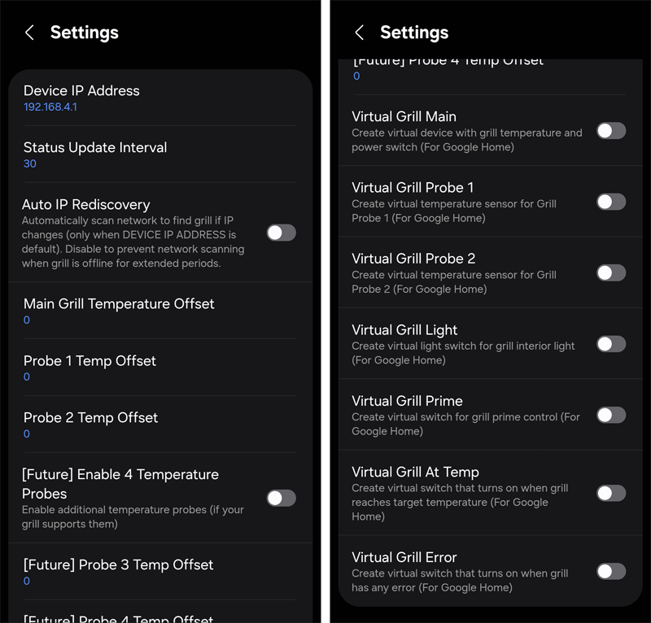</a>

_Main device preferences screen showing all configuration options (click to enlarge)_

---

## Network Configuration

### IP Address Management

The driver automatically discovers and tracks your grill's IP address, but manual configuration may be needed in some cases.

#### Automatic IP Detection (Recommended)

- **How it works**: Driver scans local network for compatible grills during initial discovery
- **Default behavior**: IP address is detected once during setup
- **No configuration needed**: Works out of the box for initial setup

> 📱 **Screen Timeout Note**: When SmartThings is scanning for devices, keep your phone/tablet screen active. Touch random areas periodically to prevent auto-lock, as the scan may fail if the app becomes inactive.

#### Manual IP Configuration

**When to use manual IP**:

- Auto-discovery fails consistently
- Fixed IP assignment preferred
- Network security restrictions

**Steps to configure**:

1. **Find your grill's IP address**:

   ```
   Router admin panel → Connected devices → Find "Pit Boss" or similar
   Network scanner app → Look for device on port 80
   Command line: nmap -p 80 192.168.1.0/24
   ```

2. **Enter IP in device preferences**:
   - Format: `192.168.1.XXX` (no http:// or port)
   - Example: `192.168.1.150`
   - Save and wait 30 seconds for connection

<a href="images/ip-address-config.jpg">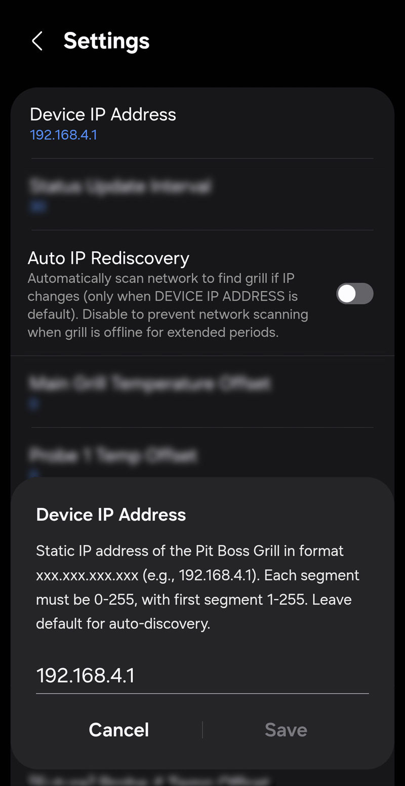</a>

_IP address setting and network discovery options (click to enlarge)_

#### Auto IP Rediscovery (Advanced)

**⚠️ Disabled by default to prevent network flooding**

This feature allows the driver to automatically scan the network when the grill becomes unreachable, but should be used carefully.

**When to enable**:

- Grill IP changes frequently (DHCP without reservation)
- Network topology changes regularly
- Grill moves between networks

**Requirements for Auto Rediscovery**:

- ✅ **Auto IP Rediscovery** preference must be enabled
- ✅ **IP Address** preference must be set to default (`192.168.4.1`)

**Rediscovery Triggers**:

- ✅ Immediate (on enable while offline)
- ✅ Active (recently active ≤5m)
- ✅ Periodic (every 24h for inactive devices)

**Important Limitations**:

- Custom IP disables rediscovery logic
- Scans up to 230 hosts (10–250 range) – use sparingly
- Cooldown prevents rapid repeat scans
- Active priority ensures recently hot grills reconnected ASAP

**Best Practices**:

1. **Leave disabled** unless you have specific IP change issues
2. **Use DHCP reservations** instead when possible
3. **Monitor network impact** if enabled
4. **Consider manual IP** for stable network environments

### Network Troubleshooting

- **Same Network Required**: Hub and grill must be on identical network/VLAN
- **No Port Forwarding**: Driver uses standard HTTP (port 80)
- **Firewall**: Generally no configuration needed
- **Mesh Networks**: Ensure devices can communicate across access points

---

## Monitoring and Performance Settings

### Status Update Interval Configuration

| Interval         | Best For                | Network Impact | Data Accuracy |
| ---------------- | ----------------------- | -------------- | ------------- |
| **5-15 seconds** | Active cooking sessions | Higher         | Excellent     |
| **30 seconds**   | General monitoring      | Balanced       | Very Good     |
| **60+ seconds**  | Background monitoring   | Lower          | Good          |

#### Special Monitoring Modes

- **Grill Off Mode**: Automatically uses 6x refresh interval when grill is powered off
- **Preheating Mode**: Uses 50% faster updates during preheating phase (e.g., 30s → 15s)
- **Error Recovery**: Increases polling frequency during connection issues

### Performance Optimization Tips

1. **Start with 30 seconds** - adjust based on needs
2. **Increase interval** if experiencing network congestion
3. **Decrease for active cooking** when precise timing matters
4. **Consider hub performance** - slower hubs may need longer intervals

---

## Temperature Configuration

### Temperature Unit Handling

> ⚠️ **SmartThings Limitation**: Temperature display units are forced by your SmartThings location setting, regardless of grill or driver preferences.

- **Location = US**: Always displays Fahrenheit
- **Location = International**: Always displays Celsius
- **Grill Setting**: Internal calculations respect grill's unit setting
- **Conversion**: Driver handles automatic unit conversion between grill and display

### Unified Probe Display

The main driver interface displays all 4 temperature probes in a unified, formatted text display:

- **All 4 Probes Visible**: Shows probes 1-4 in a single, properly spaced text field
- **Individual Components**: Probes 1 & 2 also available as separate temperature components for SmartThings automations and graphing
- **Automatic Detection**: Displays connected probes with proper temperatures, disconnected probes show "--"
- **Unicode Formatting**: Uses special spacing characters to prevent UI layout issues
- **Real-time Updates**: All probe values update together for consistent monitoring

**Example Display (2 Probes)**:

```
     ᴘʀᴏʙᴇ¹       ᴘʀᴏʙᴇ²
     165°F        140°F
```

**Example Display (4 Probes)**:

```
 P1      P2      P3      P4
165°F   140°F   --°F    155°F
```

This unified approach provides:

- **Better Overview**: See all probe states at once
- **Standard Capabilities**: Probes 1 & 2 work with existing SmartThings automations
- **Future Compatibility**: Ready for hardware with additional probe support
- **Adaptive Layout**: Automatically shows 2-probe or 4-probe format based on probe 3/4 connection status

### Temperature Calibration

#### Why Calibrate?

- **Probe accuracy**: Individual probes may read slightly high/low
- **Grill temperature**: Main sensor might need adjustment
- **Environmental factors**: Altitude, humidity can affect readings

> ⚠️ **Important**: Temperature offsets only affect SmartThings display, logs, and driver logic. The physical grill will continue to use and display the original, unadjusted temperature values on its own display and controls.

#### Advanced Calibration System

This driver uses the Steinhart-Hart equation for temperature calibration, which provides:

- **Better accuracy across the full temperature range**
- **Non-linear correction** that increases with temperature
- **Single-point calibration** based on 32°F (0°C) ice water reference

#### Calibration Process

1. **Ice Water Reference Test**:
   - Fill a glass with crushed ice, add cold water until full
   - Stir well and let sit for 30 seconds to stabilize
   - Insert probe tip 2+ inches deep, avoid touching glass
   - Note the temperature reading (should be exactly 32°F/0°C)
   - **Calculate offset**: If probe reads 35°F, set offset to -3°F

2. **Set Offsets**:
   - **Negative offset**: If probe reads HIGHER than 32°F in ice water
   - **Positive offset**: If probe reads LOWER than 32°F in ice water
   - **Example**: Probe shows 35°F in ice water → set offset to -3°F

<a href="images/temperature-calibration.png">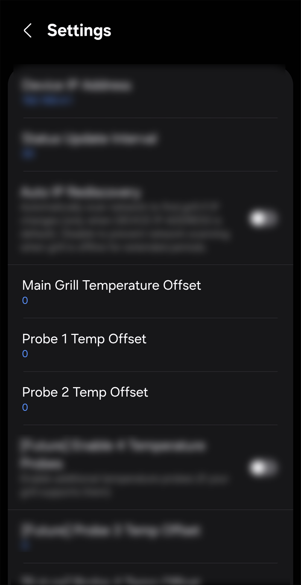</a>

_Temperature offset configuration screen for all sensors (click to enlarge)_

<a href="images/temperature-testing.jpg">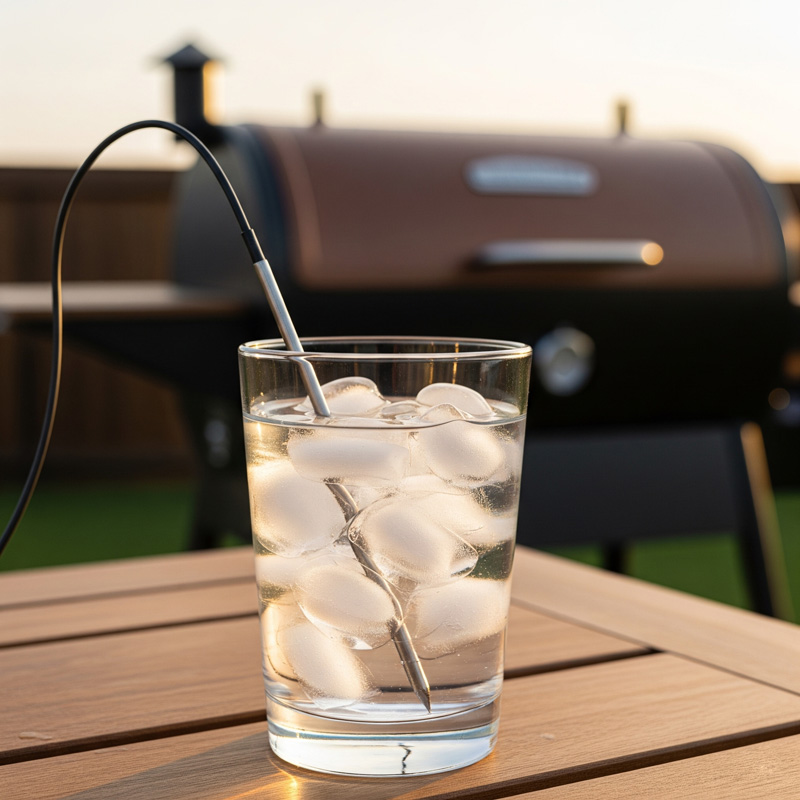</a>

_Performing an ice water test to calibrate a temperature probe (click to enlarge)_

#### Individual Offset Settings

| Sensor                     | Setting Name   | Purpose                                  |
| -------------------------- | -------------- | ---------------------------------------- |
| **Main Grill Temperature** | `grillOffset`  | Main cooking chamber sensor              |
| **Probe 1**                | `probe1Offset` | First food probe                         |
| **Probe 2**                | `probe2Offset` | Second food probe                        |
| **Probe 3**                | `probe3Offset` | Third food probe (if hardware supports)  |
| **Probe 4**                | `probe4Offset` | Fourth food probe (if hardware supports) |

#### Calibration Tips

**Ice Water Method (Required for Steinhart-Hart Calibration)**:

- **Prepare ice bath**: Fill glass with crushed ice, add cold water until full
- **Stir thoroughly**: Ensure water temperature is uniform throughout
- **Wait for stabilization**: Let mixture sit for 30-60 seconds
- **Insert probe**: Submerge probe tip 2+ inches, avoid touching glass sides/bottom
- **Read temperature**: Should show exactly 32°F (0°C)
- **Calculate offset**: If probe reads 35°F, set offset to -3°F
- **Verify**: Test multiple times for consistency

**How Steinhart-Hart Calibration Works**:

- Uses 32°F (0°C) as the reference point for all calibration
- Applies greater correction at higher temperatures (non-linear)
- More accurate than simple linear offsets across the full temperature range
- Automatically compensates for thermistor characteristics

**General Calibration Guidelines**:

- **Use ice water method only**: This calibration system is specifically designed for ice water reference
- **Document changes**: Keep notes on what adjustments you make
- **Test consistency**: Verify calibration holds across multiple cooking sessions
- **Recalibrate periodically**: Thermistors can drift over time

---

## Virtual Device Configuration

### Individual Virtual Device Controls

Each virtual device can be enabled/disabled independently based on your needs.

#### Virtual Grill Main

- **Purpose**: Core grill control and primary temperature monitoring
- **Google Home**: Essential for _"turn off the grill"_ commands
- **SmartThings**: Primary device for automations
- **Recommended**: Always enable

#### Virtual Grill Light

- **Purpose**: Dedicated interior light control
- **Google Home**: _"turn on grill light"_ commands
- **Enable if**: Your grill has interior lighting
- **Skip if**: No interior lights on your model

#### Virtual Grill Probe 1 & 2

- **Purpose**: Individual temperature probe monitoring (duplicates main display probes)
- **Google Home**: _"what's probe 1 temperature?"_ queries
- **SmartThings**: Separate automation triggers for each probe
- **Note**: Main driver displays all 4 probes in unified view
- **Enable if**: You need separate probe controls for Google Home

#### Virtual Grill Probe 3 & 4

- **Purpose**: Individual temperature probe monitoring for probes 3 & 4
- **Google Home**: _"what's probe 3 temperature?"_ queries
- **SmartThings**: Separate automation triggers for additional probes
- **Note**: Main driver displays all 4 probes in unified view
- **Enable if**: You need separate probe 3/4 controls for Google Home

#### Virtual Grill Prime

- **Purpose**: Pellet system priming control
- **Google Home**: _"turn on grill prime"_ voice control
- **Safety**: Auto-off timer prevents over-priming
- **Recommended**: Enable for voice convenience

#### Virtual Grill At-Temp

- **Purpose**: Session target reach indicator (on at ≥95% of setpoint)
- **Google Home**: _"is the grill at temp?"_ status checks
- **SmartThings**: Automation trigger when target is reached
- **Use case**: Alerts and notifications when grill is ready

#### Virtual Grill Error

- **Purpose**: Aggregated error & panic status (on if any error or panic)
- **Google Home**: _"check grill status"_ for error information
- **SmartThings**: Error-based automation triggers
- **Recommended**: Enable for proactive monitoring

<a href="images/virtual-device-options.jpg">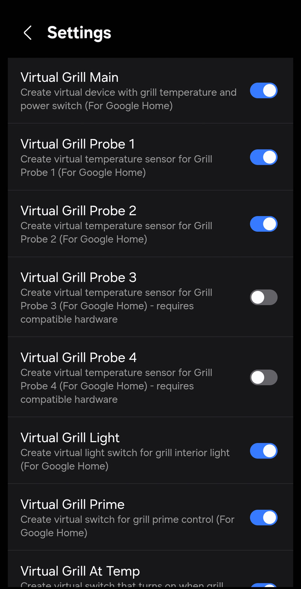</a>

_Virtual device enable/disable settings in preferences (click to enlarge)_

### Virtual Device Best Practices

1. **Start selective**: Enable only devices you'll actually use
2. **Test individually**: Verify each device works before enabling all
3. **Name consistently**: Use similar naming patterns in Google Home
4. **Monitor performance**: Too many devices can slow updates
5. **Disable unused**: Remove virtual devices you don't use

### Virtual Device Interface

When you enable virtual devices, they will appear in your SmartThings device list. The main virtual device provides a simplified interface for quick access to core functions.

|                                                     Main Virtual Device                                                     |                                                             Simplified Interface                                                             |
| :-------------------------------------------------------------------------------------------------------------------------: | :------------------------------------------------------------------------------------------------------------------------------------------: |
| <a href="images/virtual-grill-main.jpg">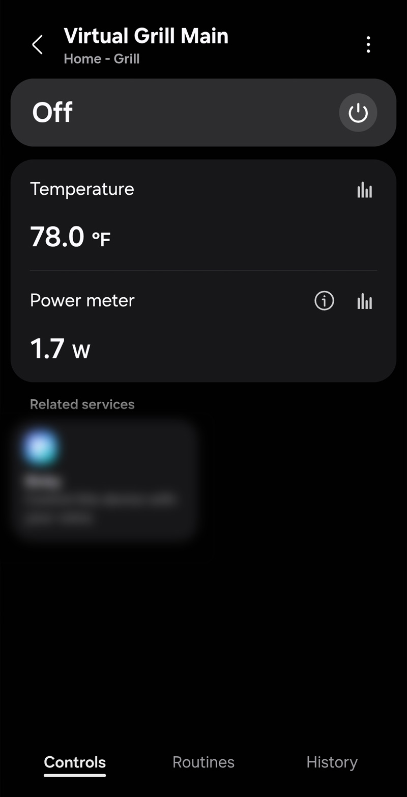</a> | <a href="images/main-virtual-simple-screen.jpg">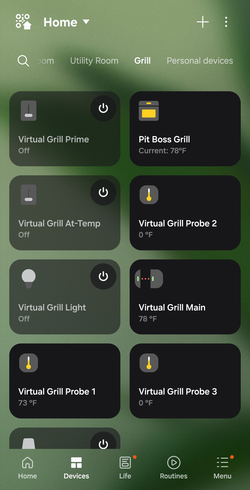</a> |

_Comparison of the main virtual device and its simplified interface (click to enlarge)._

---

## Advanced Configuration

### Session Tracking Behavior

The driver includes intelligent session management that automatically adapts to cooking patterns.

#### Preheating Detection

- **Triggers**: When grill is turned on or temperature target changes significantly
- **Behavior**: Status shows "Preheating" until first target temperature reached
- **Reset conditions**: 50°F+ temperature drops or power cycling
- **Purpose**: Distinguishes startup phase from active cooking

#### Status Progression

```
Off → Preheating → Heating → Connected → Cooling → Off
```

- **Off**: Grill powered down
- **Preheating**: Initial warmup to target temperature
- **Heating**: Active cooking, maintaining temperature
- **Connected**: At target temperature, ready for cooking
- **Cooling**: Powered off but still warm

### Power Simulation

Driver simulates power consumption based on real-world measurements from PB1285KC.

#### Power Calculation Factors

- **Grill status**: Different consumption for preheating vs maintaining
- **Target temperature**: Higher temps = more power
- **Environmental**: Adjustments for outdoor conditions (future feature)
- **Auger activity**: Pellet feed cycles affect power draw

#### Simulated Power Values

| Mode            | Typical Watts | Usage Pattern                 |
| --------------- | ------------- | ----------------------------- |
| **Startup**     | 300-400W      | Initial ignition and fan      |
| **Preheating**  | 200-300W      | Heating to target temperature |
| **Maintaining** | 50-150W       | Cycling to hold temperature   |
| **Idle/Off**    | 5-15W         | WiFi and display only         |

_Note: Values are approximated from PB1285KC testing. Other models may vary._

---

## Debugging and Diagnostics

### Debug Logging

Enable debug logging for troubleshooting connection or performance issues.

#### When to Enable Debug Mode

- Connection problems persist
- Unusual behavior or errors
- Support requests require detailed logs
- Development or testing

#### What Debug Logging Captures

- Network communication with grill
- Device state changes
- Error conditions and recovery
- Performance timing information
- Virtual device synchronization

#### Accessing Debug Logs

1. **SmartThings IDE**: Live logging section
2. **Hub logs**: Advanced users can access hub directly
3. **Support requests**: Include relevant log excerpts

<a href="images/debug-logging.png">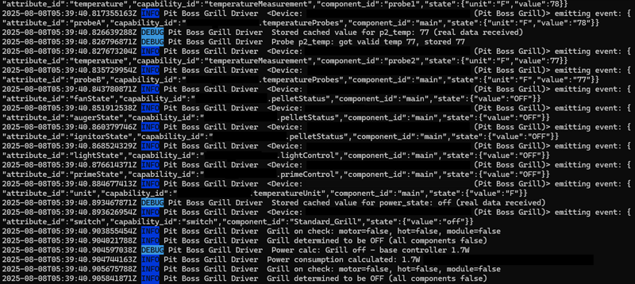</a>

_Debug logging settings and SmartThings log viewer (click to enlarge)_

### Performance Monitoring

Monitor these indicators for optimal performance:

#### Health Indicators

- **Connection status**: Should show "Connected" consistently
- **Temperature updates**: Regular updates within refresh interval
- **Error frequency**: Occasional network errors are normal (Roughly one out of every ten messages will have incomplete byte data. The driver will use cached values to fill in the missing information.)
- **Response times**: Commands should execute within 3-8 seconds

#### Warning Signs

- **Frequent disconnections**: Network, WiFi signal strength or grill issues
- **Stale temperatures**: Temperatures not updating
- **Command failures**: On/off or temperature commands failing
- **High error rates**: More than occasional communication errors

---

## Pit Boss App Management

While the SmartThings driver operates independently, you may occasionally need to use the official Pit Boss app for certain maintenance tasks.

### Common App Functions

| Function                | Screenshot                                                                                                                                   | Purpose                                  |
| ----------------------- | -------------------------------------------------------------------------------------------------------------------------------------------- | ---------------------------------------- |
| **Main Grill Screen**   | <a href="images/pb-app-main-grill-screen.png">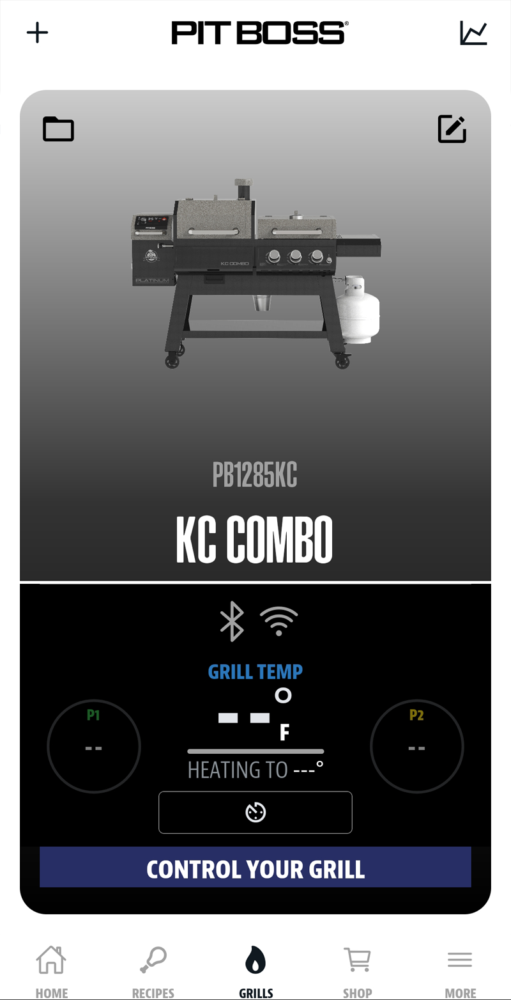</a> | Monitor grill status and basic controls  |
| **Add New Grill**       | <a href="images/pb-app-add-grill.png">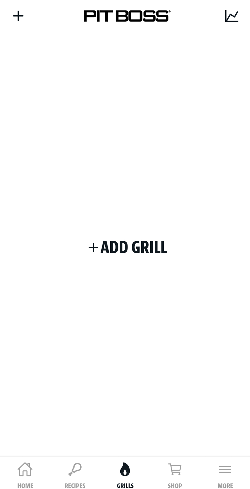</a>                      | Adding additional grills to your account |
| **Edit Grill Settings** | <a href="images/pb-app-edit-grill.png">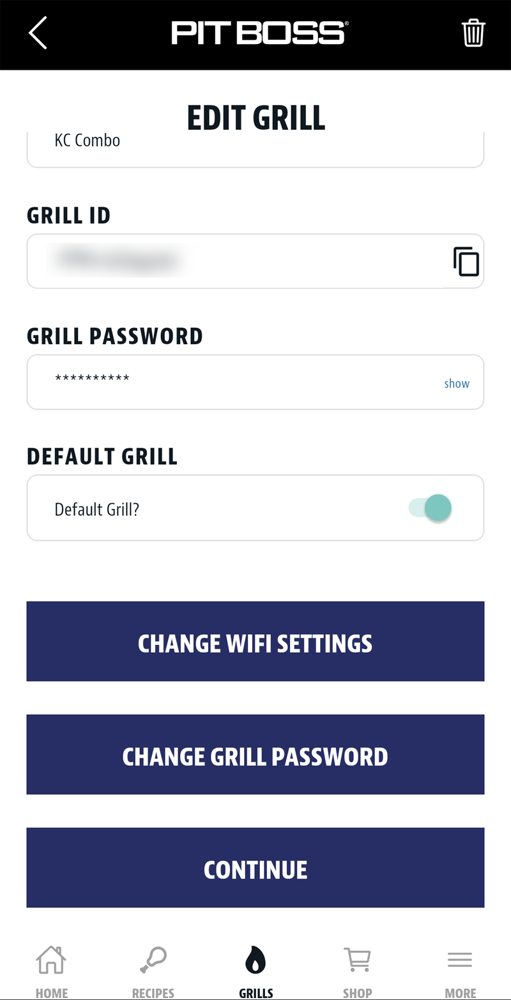</a>                    | Modify grill name and configuration      |

### Network Management

| Function                | Screenshot                                                                                                                      | Purpose                        |
| ----------------------- | ------------------------------------------------------------------------------------------------------------------------------- | ------------------------------ |
| **WiFi Network Change** | <a href="images/pb-app-change-wifi.png">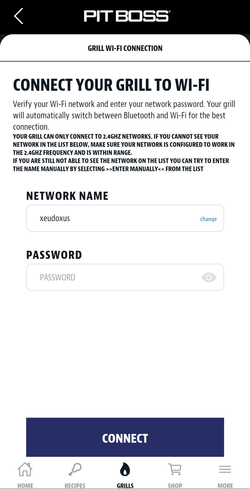</a>     | Update grill's WiFi connection |
| **Password Management** | <a href="images/pb-app-password-change.png">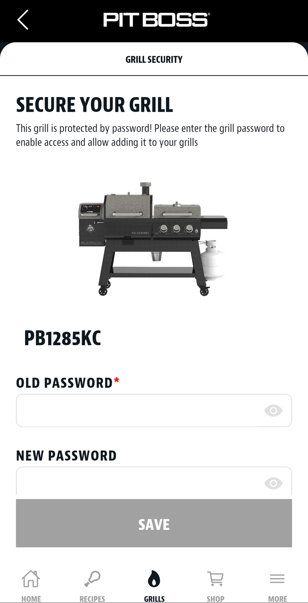</a> | Modify grill access password   |

_Official Pit Boss app interfaces for grill management and network configuration_

> **Note**: These app functions are separate from SmartThings driver operation. Use the app for initial setup and network changes, then rely on SmartThings for automation and daily control.

---

## Configuration Backup and Restore

### Export Configuration

SmartThings doesn't provide built-in configuration export, but you can document your settings:

#### Settings to Document

- IP address (if manually configured)
- Refresh interval
- All temperature offsets
- Virtual device selections
- Any custom automation triggers

#### Manual Backup Process

1. **Screenshot device preferences**
2. **Note all offset values**
3. **Document virtual device selections**
4. **Save automation configurations** separately in SmartThings

### Configuration Reset

If you need to reset configuration:

1. **Remove device** from SmartThings
2. **Re-add using device discovery**
3. **Reconfigure preferences** from backup notes
4. **Re-enable virtual devices** as needed
5. **Test all functions** before considering complete

---

## Need Help?

- **Connection Issues**: [Troubleshooting](Troubleshooting.md)
- **Google Home Setup**: [Google Home Setup](Google-Home-Setup.md)
- **Model Questions**: [Model Compatibility](Model-Compatibility.md)
- **Technical Details**: [Advanced Features](Advanced-Features.md)
