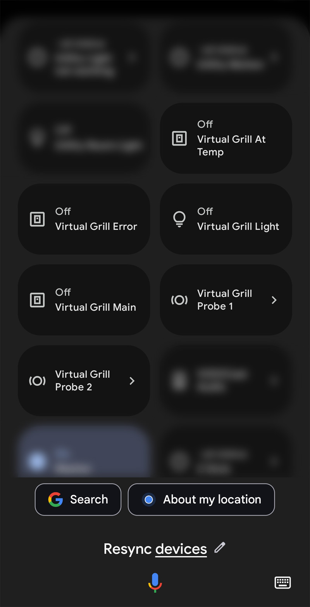
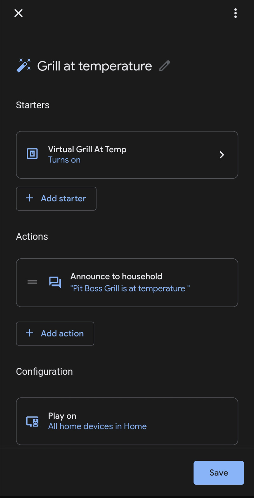

# Google Home Integration Setup

This guide helps you set up voice control for your Pit Boss grill using Google Home/Google Assistant.

> ⚠️ **Legal Notice**: This is unofficial third-party software. Pit Boss®, Google Home®, Google Assistant®, SmartThings®, and all mentioned trademarks are property of their respective owners. Use at your own risk.

## Prerequisites

- [ ] SmartThings Edge driver installed and working
- [ ] Virtual devices enabled (see [Installation Guide](Installation-Guide.md))
- [ ] Google Home app installed
- [ ] SmartThings already linked to Google Home

---

## Why Virtual Devices Are Required

> ⚠️ **Important**: The main Pit Boss driver device will NOT import into Google Home due to its complex multi-capability nature. Virtual devices are specifically designed to work around this limitation.

### What Virtual Devices Do

- **Simplified Device Types**: Each virtual device uses a single, Google Home-compatible device type
- **Voice Recognition**: Designed with device names that Google Assistant recognizes well
- **Starter Capabilities**: Each has "starter" capabilities that Google Home imports successfully

---

## Step 1: Enable Virtual Devices

### In SmartThings Driver Settings

1. **Open your Pit Boss grill device** in SmartThings
2. **Tap settings (gear icon)**
3. **Scroll to "Virtual Device Options"**
4. **Enable desired virtual devices**:

| Virtual Device              | Purpose                                       | Voice Command Examples                             |
| --------------------------- | --------------------------------------------- | -------------------------------------------------- |
| **Virtual Grill Main**      | Core grill control                            | _"Turn off the grill"_, _"What's the grill temp?"_ |
| **Virtual Grill Light**     | Interior light control                        | _"Turn on the Grill Light"_                        |
| **Virtual Grill Probe 1/2** | Individual probe temps                        | _"What's the Grill probe 1 temperature?"_          |
| **Virtual Grill Probe 3/4** | Additional probe temps (if hardware supports) | _"What's the Grill probe 3 temperature?"_          |
| **Virtual Grill Prime**     | Pellet priming                                | _"Turn on Grill Prime"_                            |
| **Virtual Grill At-Temp**   | Temperature status (≥95% target)              | _"Check grill at-temp status"_                     |
| **Virtual Grill Error**     | Status monitoring                             | _"Check grill error status"_                       |

> **💡 Pro Tip**: Some voice commands can sound unnatural. Create Google Home routines (see Step 5) to make them more natural:
>
> - _"Hey Google, prime the grill"_ → turns on Grill Prime
> - _"Hey Google, is the grill ready?"_ → checks if At-Temp is on
> - _"Hey Google, any grill errors?"_ → checks if Error is on

### Main Virtual Device Display

|                                                                    Device Details                                                                     |                                                                        Temperature Display                                                                        |
| :---------------------------------------------------------------------------------------------------------------------------------------------------: | :---------------------------------------------------------------------------------------------------------------------------------------------------------------: |
| <a href="images/home-virtual-main-details.jpg"></a> | <a href="images/home-virtual-main-display.jpg"></a> |

_How the main virtual grill device appears in Google Home, showing both device details and temperature information (click to enlarge)._

---

## Step 2: Sync with Google Home

### Method 1: Voice Command (Easiest)

1. **Say**: _"Hey Google, sync my devices"_
2. **Wait 1-2 minutes** for sync to complete
3. **Check Google Home app** for new devices

### Method 2: Manual Sync

1. **Open Google Home app**
2. **Tap "+" → Add Device**
3. **Select "Works with Google"**
4. **Find and tap "SmartThings"**
5. **Tap "Sync Account"**

|                                                           Manual Sync Process                                                           |                                                           Sync Completion                                                           |
| :-------------------------------------------------------------------------------------------------------------------------------------: | :---------------------------------------------------------------------------------------------------------------------------------: |
| <a href="images/google-home-sync-1.jpg"></a> | <a href="images/google-home-sync-2.jpg"></a> |

_Google Home device sync process showing SmartThings integration (click to enlarge)._

---

## Step 3: Device Naming and Organization

### Rename Devices for Better Voice Recognition

1. **In Google Home app**, find your new virtual devices
2. **Rename each device** with clear, voice-friendly names:
   - `Grill` or `Pit Boss Grill` (main device)
   - `Grill Light` (light control)
   - `Grill Prime` (pellet prime)
   - `Probe 1`, `Probe 2`, `Probe 3`, `Probe 4` (temperature probes)

### Device Naming Before and After

|                                                                       Before Renaming                                                                       |                                                                      After Renaming                                                                      |
| :---------------------------------------------------------------------------------------------------------------------------------------------------------: | :------------------------------------------------------------------------------------------------------------------------------------------------------: |
| <a href="images/home-virtual-before-rename.jpg"></a> | <a href="images/home-virtual-after-rename.jpg"></a> |

_Comparison showing Google Home device names before and after optimization for voice commands (click to enlarge)._

### Add to Rooms

1. **Assign devices to appropriate rooms** (Outdoor, Patio, etc.)
2. **This enables room-based commands**: _"Turn off the patio grill"_

---

## Step 4: Test Voice Commands

### Basic Control Commands

```
"Hey Google, turn off the grill"
"Hey Google, turn on the grill light"
"Hey Google, turn off the grill light"
"Hey Google, turn on grill prime"
```

### Status and Temperature Commands

```
"Hey Google, what's the grill temperature?"
"Hey Google, what's the grill probe 1 temperature?"
"Hey Google, what's the grill probe 3 temperature?"  # If hardware supports
"Hey Google, is the grill at temp?"
"Hey Google, check grill status"
```

### Room-Based Commands (if assigned to rooms)

```
"Hey Google, turn off the patio grill"
"Hey Google, what's the outside grill temperature?"
```

---

## Step 5: Advanced Voice Setup

### Create Google Home Routines

1. **Open Google Home app**
2. **Tap "Routines"**
3. **Create custom routines** for complex actions:

**Example Routine: "Prime the Grill"**

- **Trigger**: _"Hey Google, prime the grill"_
- **Actions**:
  - Turn on Grill Prime
- **Purpose**: Makes natural phrasing work instead of "Hey Google, turn on grill prime"

|                                                       Routine Setup Steps                                                        |                                                      Routine Configuration                                                       |                                                          Final Routine                                                           |
| :------------------------------------------------------------------------------------------------------------------------------: | :------------------------------------------------------------------------------------------------------------------------------: | :------------------------------------------------------------------------------------------------------------------------------: |
| <a href="images/home-starter-1.jpg"></a> | <a href="images/home-starter-2.jpg"></a> | <a href="images/home-starter-3.jpg"></a> |

_Creating automated routines in Google Home using grill devices (click to enlarge)._

---

## Troubleshooting Google Home Issues

### Virtual Devices Don't Appear

1. **Verify virtual devices are enabled** in SmartThings driver settings
2. **Wait 60 seconds** after enabling, then sync Google Home
3. **Check device names** - avoid special characters
4. **Try manual sync** in Google Home app

### Voice Commands Don't Work

1. **Check device names** - use simple, clear names
2. **Try exact device names** as shown in Google Home app
3. **Ensure devices are assigned to rooms**
4. **Test with "the" prefix**: _"Turn on THE grill light"_

### Temperature Readings Don't Work

1. **Temperature sensors work differently** - Google may not read them aloud
2. **Use SmartThings app** for temperature monitoring
3. **Consider SmartThings routines** that announce temperatures

### Commands Are Misunderstood

1. **Speak clearly and slowly**
2. **Use exact device names** from Google Home app
3. **Try alternative phrasings**:
   - Instead of "grill", try "pit boss" or "smoker"
   - Add "the" before device names

---

## Best Practices

### Device Naming Tips

- **Keep names short and clear**: "Grill Light" vs "Pit Boss Interior Light"
- **Avoid similar sounding names**: Don't name multiple devices "Grill X"
- **Use consistent prefixes**: All devices start with "Grill" for easy recognition

### Voice Command Tips

- **Be specific**: _"Turn off the grill light"_ vs _"Turn off grill"_
- **Use room names**: _"Turn off the patio grill"_
- **Check status first**: _"Is the grill on?"_ before giving commands

---

## What Google Home Can and Cannot Do

### ✅ What Works Well

- Turn grill on/off
- Control interior lights
- Activate pellet prime function
- Basic status checking
- Room-based commands

### ❌ Current Limitations

- Cannot set target temperature directly via voice (create SmartThings Routine as workaround)
- **⚠️ Safety Warning**: Do NOT configure virtual grill devices as general home thermostat devices. General thermostat commands (like "set thermostat to 72°") could accidentally trigger grill temperature changes, leading to dangerous situations.
- Other options for voice temperature control are being explored
- Probe temperature readouts sometimes summarized/not verbalized by Google
- Advanced custom capabilities (pellet status, unit change) not exposed

### 🔄 Workarounds

- SmartThings Routines (link to a virtual switch → automation sets temperature)
- Announce readiness by triggering routine off At-Temp virtual switch
- Use consistent naming for fewer misrecognitions

---

## Need More Help?

- **Installation Issues**: [Installation Guide](Installation-Guide.md)
- **Device Problems**: [Troubleshooting](Troubleshooting.md)
- **Report Voice Control Issues**: [GitHub Issues](https://github.com/xeudoxus/pitboss-grill-driver/issues)
