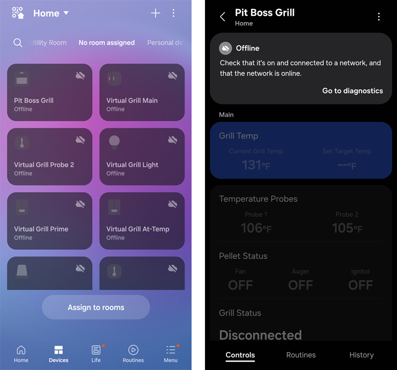
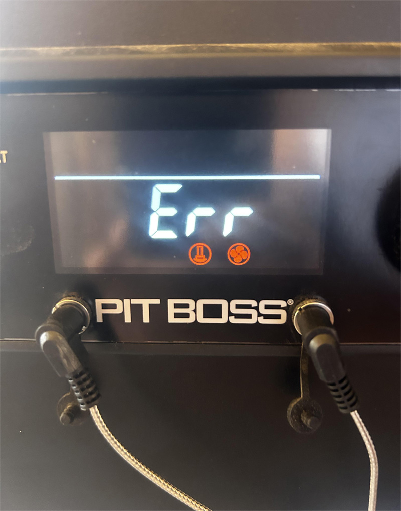
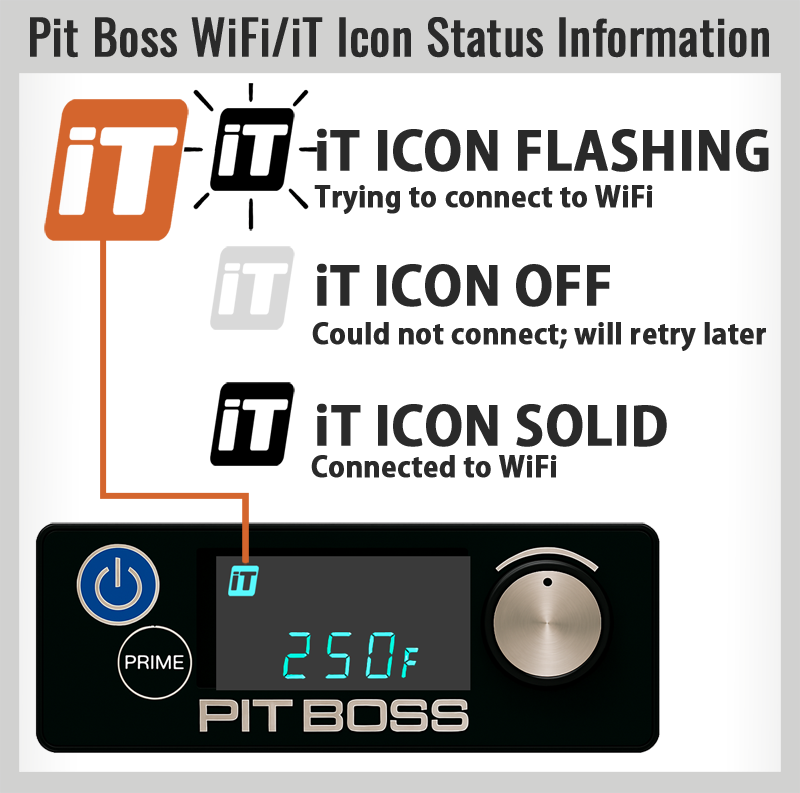

# Troubleshooting Guide

This comprehensive troubleshooting guide covers common issues, diagnostic steps, and solutions for the Pit Boss grill driver.

> ⚠️ **Legal Notice**: This is unofficial third-party software. Pit Boss®, SmartThings®, and all mentioned trademarks are property of their respective owners. Use at your own risk.

## Quick Diagnostic Checklist

Before diving into specific issues, verify these basics:

- [ ] Grill is powered on and connected to WiFi
- [ ] Grill and SmartThings hub are on the same network (same subnet / VLAN)
- [ ] SmartThings Edge driver is properly installed
- [ ] Device shows as "online" in SmartThings app
- [ ] Grill firmware ≥ 0.5.7

_SmartThings device status indicators and health monitoring (click to enlarge)_

_Example of grill display showing error condition that triggers panic state (click to enlarge)_

---

## Connection and Discovery Issues

### Device Not Discovered During Setup

#### Symptoms

- SmartThings scan finds no Pit Boss devices
- Manual device addition fails
- No grill appears in available devices

#### Diagnostic Steps

1. **Verify grill WiFi connection**:
   - Check grill display for WiFi/"iT" icon status:
     - 🔁 **Flashing "iT" icon** → Trying to connect to WiFi
     - ⚫ **Off "iT" icon** → Could not connect; will retry later
     - 🟢 **Solid "iT" icon** → Connected to WiFi
   - Test with official Pit Boss app (if available)
   - Verify grill appears in router's connected devices list

2. **Check network compatibility / IP**:
   - Confirm hub and grill on same network/VLAN
   - Test network communication: `ping [grill-ip-address]`
   - Verify no guest network isolation

   

   _Using a ping command to test network connectivity to the grill (click to enlarge)._

3. **Prevent SmartThings app timeout during scanning**:
   - **Keep the SmartThings app active** - do not let your phone/tablet screen timeout or auto-lock
   - **Touch random areas of the screen** periodically during the scan to prevent timeout
   - **Wait the full scan duration** (typically 30-60 seconds) before assuming discovery failed
   - **Do not switch apps or use other phone features** while scanning is in progress

4. **Driver installation verification**:
   - Check SmartThings hub has Edge driver installed
   - Verify driver version is current
   - Restart hub if necessary

_Pit Boss Network troubleshooting info (click to enlarge)_

#### Solutions

**Solution 1: Manual IP Configuration (After Reserving IP)**

1. Find grill IP address in router admin panel
2. Open SmartThings app → Add Device → Manual entry
3. Enter IP address in device preferences
4. Wait 60 seconds for connection

**Solution 2: Network Reset / Sequence**

1. Restart SmartThings hub
2. Restart grill (power cycle)
3. Restart WiFi router/access point
4. Wait 5 minutes, retry discovery

**Solution 3: Re-configure Grill WiFi / Firmware Check**

1. Use Pit Boss Grills app to reconnect grill to WiFi
2. Verify connection in app
3. Retry SmartThings device discovery

### Frequent Disconnections

#### Symptoms

- Device shows as "offline" intermittently
- Temperature readings stop updating
- Commands fail sporadically

#### Common Causes

- **WiFi signal strength**: Grill too far from access point
- **Network congestion**: Too many devices on WiFi
- **IP address changes**: Router reassigning IP addresses
- **Grill firmware**: Outdated grill software

#### Solutions

**Improve WiFi Signal**:

- Move grill closer to WiFi access point
- Add WiFi extender/mesh node near grill location
- Switch to less congested WiFi channel
- Use 2.4GHz instead of 5GHz if available

**Network Stability**:

- Assign static/reserved IP to grill in router settings
- Reduce refresh interval to decrease network load
- Monitor other network devices for conflicts

**Grill Maintenance**:

- Check for grill firmware updates
- Clean WiFi antenna area (consult manual)
- Verify grill power supply stability

_WiFi signal testing and improvement steps for grill connectivity_

### Grill IP Address Changes

#### Symptoms

- Device shows as "offline" after working previously
- Connection lost after router restart or network changes
- Grill works with official app but not SmartThings

#### Understanding IP Address Changes

Most routers use DHCP to automatically assign IP addresses, which can change when:

- Router restarts or power cycles
- DHCP lease expires (typically 24-168 hours)
- Network configuration changes
- Other devices join/leave the network

#### Solutions

**Option 1: Router DHCP Reservation (Recommended)**

1. **Find grill's MAC address** in router admin panel
2. **Create DHCP reservation** for grill's MAC address
3. **Assign fixed IP** (e.g., 192.168.1.150)
4. **Update driver preferences** with the reserved IP address

**Option 2: Enable Auto IP Rediscovery (Advanced)**
⚠️ **Use carefully - can impact network performance**

1. **Keep IP Address preference** set to default (`192.168.4.1`)
2. **Enable "Auto IP Rediscovery"** in device preferences
3. **Monitor network impact** - scans up to 230 addresses when triggered

> 📱 **Rediscovery Scanning**: When auto-rediscovery is triggered, keep the SmartThings app active on your device. The rediscovery scan may fail if the app times out or becomes inactive during the process.

**Auto Rediscovery Behavior**:

- Only works when IP preference is default (`192.168.4.1`)
- **Immediate scan** when preference is enabled and device is offline
- **Active grill priority** - scans immediately for recently active grills (within 5 minutes)
- **Periodic scanning** - scans every 24 hours for inactive grills to prevent permanent loss
- Has cooldown period to prevent excessive network traffic
- Disabled by default to protect network performance

**Option 3: Manual IP Update**

1. **Find new grill IP** in router admin panel or network scanner
2. **Update IP Address preference** in SmartThings device settings
3. **Wait 30 seconds** for reconnection

#### Prevention Tips

- **Use DHCP reservations** instead of auto-rediscovery when possible
- **Monitor router logs** for IP assignment patterns
- **Consider static IP** configuration on grill if supported
- **Document IP changes** to identify patterns

---

## Temperature and Sensor Issues

### Inaccurate Temperature Readings

#### Symptoms

- Grill temperature significantly off from external thermometer
- Probe readings don't match actual food temperature
- Temperatures seem to fluctuate unreasonably

#### Diagnostic Process

1. **Test probes with ice water method**:
   - Fill glass with ice, add cold water until full
   - Stir and let sit for 30 seconds to stabilize
   - Insert probe 2+ inches deep, avoid touching glass
   - Should read exactly 32°F (0°C)
   - Document any differences for offset calculation

2. **Check probe connections**:
   - Ensure probes firmly seated in grill ports
   - Inspect probe cables for damage
   - Test probes in different ports

3. **Environmental factors**:
   - Wind affecting grill temperature
   - Ambient temperature extremes
   - Grill placement and ventilation

_Proper thermometer comparison testing for calibration (click to enlarge)_

#### Solutions

**Calibrate Temperature Using Steinhart-Hart Method**:

1. **Use ice water method for probes** (required for Steinhart-Hart calibration):
   - Fill glass with crushed ice, add cold water until full
   - Stir thoroughly to ensure uniform temperature
   - Insert probe 2+ inches deep, avoid touching glass sides/bottom
   - Should read exactly 32°F (0°C)
   - Calculate offset: If reads 35°F, set offset to -3°F (negative if reading is too high)
2. Open device preferences in SmartThings and set calculated offsets
3. The driver will automatically apply greater correction at higher temperatures
4. Test adjustments over multiple cooking sessions

**Probe Troubleshooting**:

- Clean probe connections with contact cleaner
- Test probes individually to isolate issues
- Replace damaged probes with compatible models

### Temperature Not Updating (Or Panic State Triggered)

#### Symptoms

- Temperature values frozen/not changing
- Last update time shows old timestamp
- Manual refresh doesn't update readings

#### Quick Fixes

1. **Refresh device manually**: Pull down in SmartThings app
2. **Check network connection**: Verify grill WiFi status:
   - 🔁 **Flashing "iT" icon** → Trying to connect to WiFi
   - ⚫ **Off "iT" icon** → Could not connect; will retry later
   - 🟢 **Solid "iT" icon** → Connected to WiFi
3. **Restart driver**: Remove and re-add device if necessary
4. **Panic Message?**: If status shows PANIC, grill was recently active when link lost – verify grill physically (safety first), network power, then allow auto-clear after reconnection.

#### Advanced Diagnosis

1. **Enable debug logging** in device preferences
2. **Monitor logs** for communication errors
3. **Check refresh interval** - may be set to
