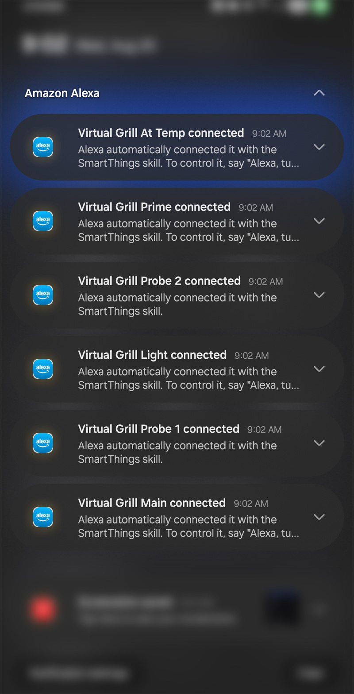
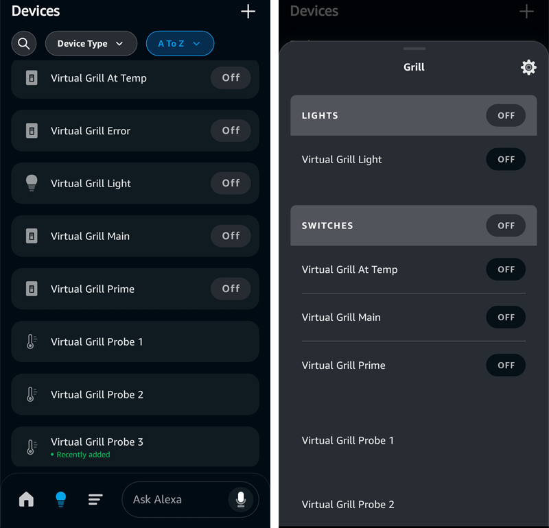

# Amazon Alexa Integration Setup

This guide helps you set up voice control for your Pit Boss grill using Amazon Alexa.

> ⚠️ **Legal Notice**: This is unofficial third-party software. Pit Boss®, Amazon Alexa®, SmartThings®, and all mentioned trademarks are property of their respective owners. Use at your own risk.

## Prerequisites
- [ ] SmartThings Edge driver installed and working
- [ ] Virtual devices enabled (see [Installation Guide](Installation-Guide.md))
- [ ] Amazon Alexa app installed
- [ ] SmartThings already linked to Alexa

---

## Current Alexa Integration Status

> ⚠️ **Important**: Based on testing, Alexa integration has significant limitations compared to Google Home. This guide documents the current state and known issues.

### What Works ✅
- **Virtual devices import successfully** into Alexa
- **Virtual switches can be controlled** via voice commands
- **Virtual switches work in Alexa Routines** (Actions section)
- **Basic on/off control** for grill power, lights, prime function
- **Temperature probe monitoring** - full visual display and voice commands

### Current Limitations ❌
- **Main grill device does not import** into Alexa (similar to Google Home)
- **Virtual Grill Main shows only as a switch** (grill power)
- **Simulated power consumption not visible** in Alexa
- **Main grill temperature not accessible** via Alexa voice commands (switch only, no temperature sensor)
- **Virtual devices don't appear in Routine triggers** ("When" section)

---

## Step 1: Enable Virtual Devices

### In SmartThings Driver Settings
1. **Open your Pit Boss grill device** in SmartThings
2. **Tap settings (gear icon)**
3. **Scroll to "Virtual Device Options"**
4. **Enable desired virtual devices**:

| Virtual Device | Alexa Functionality | Voice Command Examples |
|----------------|-------------------|----------------------|
| **Virtual Grill Main** | Switch only (power control) | *"Alexa, turn off the grill"* |
| **Virtual Grill Light** | Switch control | *"Alexa, turn on the grill light"* |
| **Virtual Grill Probe 1/2** | Full temperature sensor (visual + voice) | *"Alexa, what's probe 1 temperature?"* |
| **Virtual Grill Prime** | Switch control | *"Alexa, turn on grill prime"* |
| **Virtual Grill At-Temp** | Switch status | *"Alexa, is the grill at temp?"* |
| **Virtual Grill Error** | Switch status | *"Alexa, check grill status"* |

> **💡 Pro Tip**: Create Alexa routines (see Step 4) to make voice commands more natural:
> - *"Alexa, prime the grill"* → turns on Grill Prime
> - *"Alexa, is the grill ready?"* → checks if At-Temp is on

---

## Step 2: Link SmartThings to Alexa

### If Not Already Linked
1. **Open Alexa app**
2. **Tap "More" → "Skills & Games"**
3. **Search for "SmartThings"**
4. **Enable the SmartThings skill**
5. **Sign in with your Samsung account**
6. **Authorize device access**

### Virtual Devices Appear Automatically
> ✅ **Note**: Unlike Google Home, Alexa automatically adds new SmartThings virtual devices without requiring a manual sync. Virtual devices will appear in your Alexa app within minutes of being enabled.



*Alexa automatically notifies you when new devices are detected*

**Manual Discovery (Optional)**:
1. **Say**: *"Alexa, discover my devices"*
2. **Or in Alexa app**: Devices → "+" → Add Device → SmartThings
3. **Note**: This is typically unnecessary as devices appear automatically

---

## Step 3: Device Organization

### Rename Devices for Better Voice Recognition
1. **In Alexa app**, go to Devices
2. **Find your virtual grill devices**
3. **Rename each device** with clear, voice-friendly names:
   - `Grill` or `Pit Boss Grill` (main power switch) *Off Only*
   - `Grill Light` (light control)
   - `Grill Prime` (pellet prime)

### Virtual Devices in Alexa


*How the virtual grill devices appear in the Amazon Alexa app after discovery.*

---

## Step 4: Test Voice Commands

### Working Commands ✅
```
"Alexa, turn off the grill"
"Alexa, turn on the grill light"
"Alexa, turn off the grill light"
"Alexa, turn on the grill prime"
"Alexa, what's the grill probe 1 temperature?"
"Alexa, what's the grill probe 2 temperature?"
```

### Limited/Non-Working Commands ❌
```
"Alexa, what's the grill temperature?" (won't work - main grill shows as switch only)
"Alexa, is the grill at temp?" (may work as switch status)
```

---

## Step 5: Alexa Routines Setup

### What Works in Routines
- **Actions Section**: Virtual switches can be controlled
- **Voice Triggers**: Custom phrases can trigger grill actions

### Current Limitation
- **"When" Section**: Virtual devices don't appear as triggers
- **Workaround**: May need to explore virtual motion sensors for trigger capability

### Example Routine: "Start Grilling"
1. **Open Alexa app → Routines**
2. **Create new routine**
3. **When**: Voice trigger *"Start grilling"*
4. **Actions**: 
   - Turn off grill (virtual main switch)
   - Turn on grill light
   - (Cannot set temperature directly)

---

## Known Issues and Workarounds

### Issue: Temperature Control Not Available
**Problem**: Cannot set target temperature via Alexa voice commands
**Workaround**: 
- Use SmartThings app for temperature control
- Create SmartThings routines triggered by virtual switches
- Consider using SmartThings Scenes accessible via Alexa

### Issue: Virtual Devices Don't Trigger Routines
**Problem**: Virtual devices don't appear in "When" section of Alexa routines
**Potential Workaround**: 
- Investigate adding virtual motion sensor capability
- Use SmartThings routines instead of Alexa routines for complex automation

### Issue: Main Grill Temperature Not Available
**Problem**: Main grill temperature not available in Alexa (Virtual Grill Main shows as switch only)
**Workaround**:
- Use SmartThings app for main grill temperature monitoring
- **Probe temperatures work fully** in Alexa (visual display + voice commands)
- Set up SmartThings notifications for temperature alerts

---

## Comparison: Alexa vs Google Home

| Feature | Google Home | Amazon Alexa | Notes |
|---------|-------------|--------------|-------|
| Virtual Device Import | ✅ Full | ✅ Full | Both import virtual devices |
| Main Device Import | ❌ No | ❌ No | Neither imports main device |
| Switch Control | ✅ Full | ✅ Full | Both control switches well |
| Probe Temperature Monitoring | ✅ Full | ✅ Full | Both show temps visually + voice commands |
| Main Grill Temperature | ⚠️ Limited | ❌ No | Google sometimes reads; Alexa shows switch only |
| Routine Actions | ✅ Yes | ✅ Yes | Both can control in actions |
| Routine Triggers | ❌ No | ❌ No | Neither sees devices as triggers |
| Power Consumption | ❌ No | ❌ No | Neither shows power data |

---

## Future Improvements Under Investigation

### Potential Enhancements
- **Virtual Motion Sensor**: May enable Alexa routine triggers
- **Temperature Announcements**: Via SmartThings routine integration
- **Custom Skills**: Potential for enhanced Alexa integration

### Testing Needed
- Virtual motion sensor capability for routine triggers
- Temperature sensor voice readout functionality
- Custom Alexa skill development possibilities

---

## Troubleshooting Alexa Issues

### Virtual Devices Don't Appear
1. **Verify virtual devices are enabled** in SmartThings driver settings
2. **Wait 60 seconds** after enabling, then discover devices in Alexa
3. **Try manual discovery** in Alexa app
4. **Check SmartThings skill** is properly linked

### Voice Commands Don't Work
1. **Use exact device names** as shown in Alexa app
2. **Speak clearly and slowly**
3. **Try alternative phrasings**:
   - *"Turn off THE grill"* vs *"Turn off grill"*
   - *"Grill light"* vs *"Light"*

### Devices Don't Control Properly
1. **Check device status** in SmartThings app
2. **Verify network connectivity** of grill
3. **Test control via SmartThings** first
4. **Re-discover devices** in Alexa if needed

---

## Best Practices

### Device Naming Tips
- **Keep names simple**: "Grill Light" vs "Pit Boss Interior Light"
- **Avoid conflicts**: Don't use names similar to other Alexa devices
- **Use consistent prefixes**: "Grill" prefix for all related devices

### Voice Command Tips
- **Be specific**: *"Turn on the grill light"* vs *"Turn on light"*
- **Use room names**: *"Turn off the patio grill"* (if assigned to rooms)
- **Test variations**: Try different phrasings if commands don't work

---

## Current Status Summary

**Alexa integration is functional with excellent probe temperature support.** The main benefits are:
- Basic switch control for grill power, lights, and prime function
- **Full probe temperature monitoring** (visual display in Alexa app + voice commands)
- Integration with Alexa routines for automation
- Room-based voice commands

**Major limitations include:**
- No main grill temperature reading via voice (Virtual Grill Main shows as switch only)
- No temperature control via voice
- Virtual devices don't trigger Alexa routines
- Limited functionality compared to SmartThings app

**Recommendation**: Use Alexa for basic on/off control, but rely on SmartThings app for temperature management and monitoring.

---

## Need More Help?
- **Installation Issues**: [Installation Guide](Installation-Guide.md)
- **Device Problems**: [Troubleshooting](Troubleshooting.md)
- **Compare with Google Home**: [Google Home Setup](Google-Home-Setup.md)
- **Report Alexa Issues**: [GitHub Issues](https://github.com/xeudoxus/pitboss-grill-driver/issues)