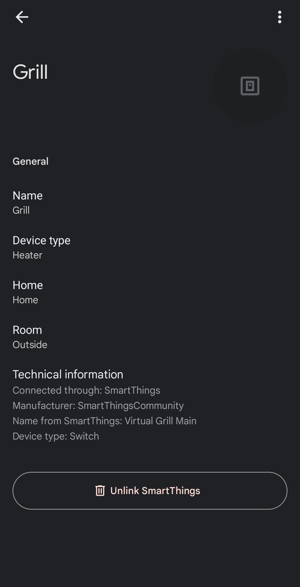
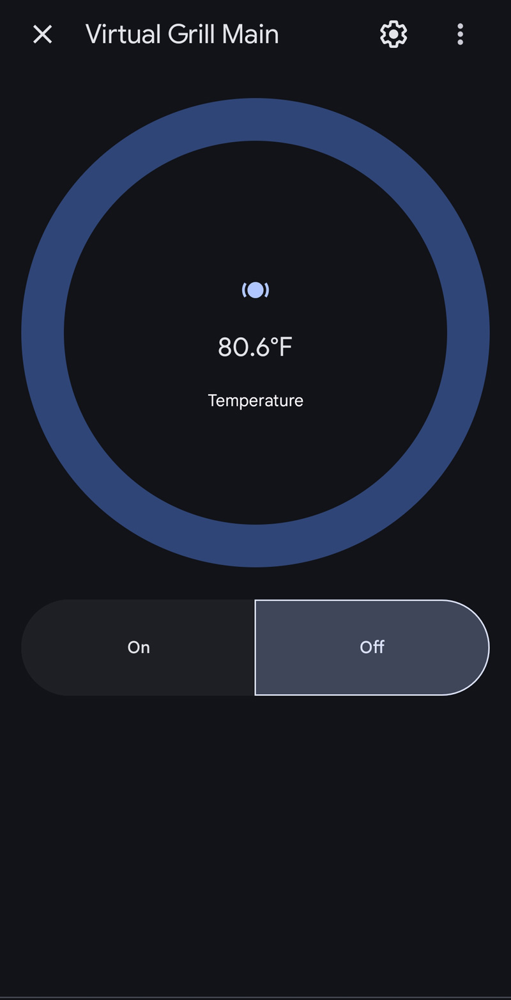
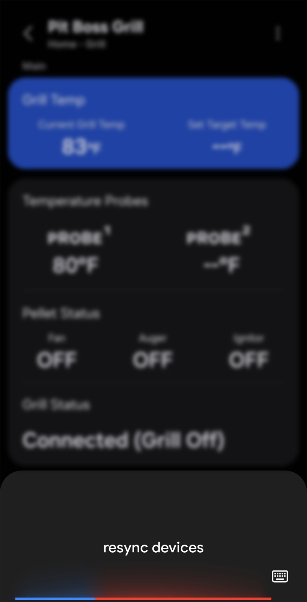
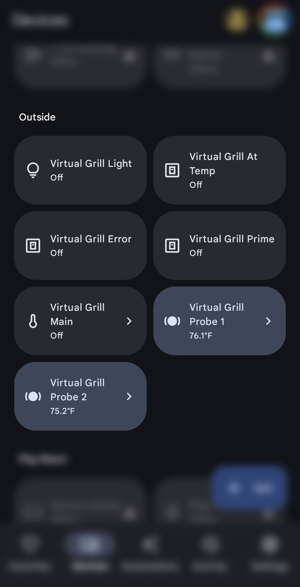
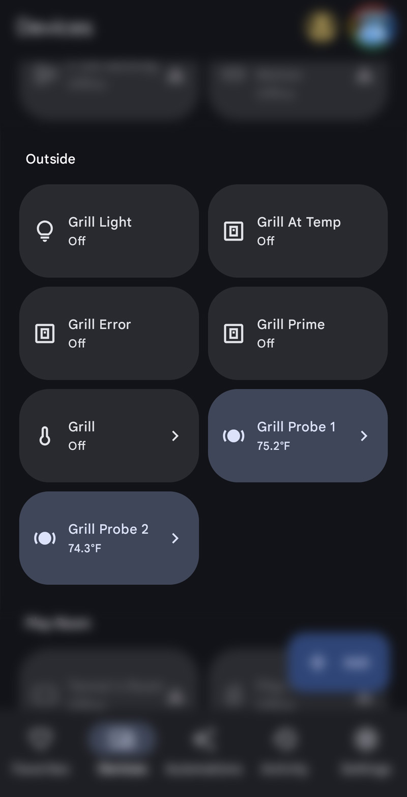
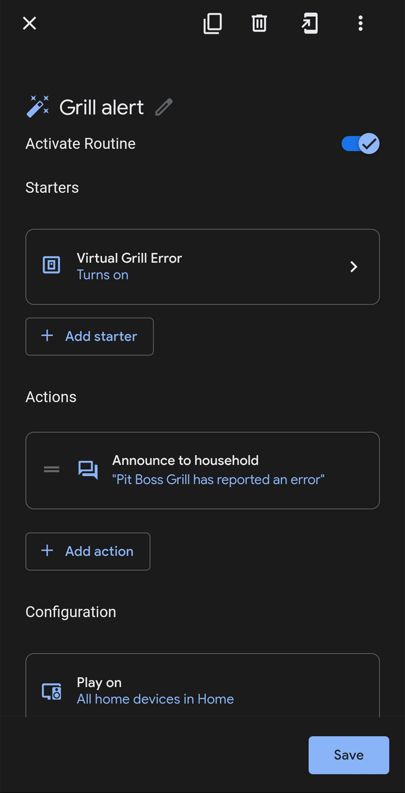
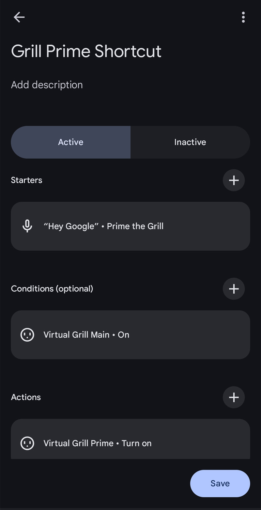

# Google Home Integration Setup

This guide helps you set up voice control for your Pit Boss grill using Google Home/Google Assistant.

> ⚠️ **Legal Notice**: This is unofficial third-party software. Pit Boss®, Google Home®, Google Assistant®, SmartThings®, and all mentioned trademarks are property of their respective owners. Use at your own risk.

## Prerequisites
- [ ] SmartThings Edge driver installed and working
- [ ] Virtual devices enabled (see [Installation Guide](Installation-Guide.md))
- [ ] Google Home app installed
- [ ] SmartThings already linked to Google Home

---

## Why Virtual Devices Are Required

> ⚠️ **Important**: The main Pit Boss driver device will NOT import into Google Home due to its complex multi-capability nature. Virtual devices are specifically designed to work around this limitation.

### What Virtual Devices Do
- **Simplified Device Types**: Each virtual device uses a single, Google Home-compatible device type
- **Voice Recognition**: Designed with device names that Google Assistant recognizes well
- **Starter Capabilities**: Each has "starter" capabilities that Google Home imports successfully

---

## Step 1: Enable Virtual Devices

### In SmartThings Driver Settings
1. **Open your Pit Boss grill device** in SmartThings
2. **Tap settings (gear icon)**
3. **Scroll to "Virtual Device Options"**
4. **Enable desired virtual devices**:

| Virtual Device | Purpose | Voice Command Examples |
|----------------|---------|----------------------|
| **Virtual Grill Main** | Core grill control | *"Turn off the grill"*, *"What's the grill temp?"* |
| **Virtual Grill Light** | Interior light control | *"Turn on the Grill Light"* |
| **Virtual Grill Probe 1/2** | Individual probe temps | *"What's the Grill probe 1 temperature?"* |
| **Virtual Grill Probe 3/4** | Additional probe temps (if hardware supports) | *"What's the Grill probe 3 temperature?"* |
| **Virtual Grill Prime** | Pellet priming | *"Turn on Grill Prime"* |
| **Virtual Grill At-Temp** | Temperature status (≥95% target) | *"Check grill at-temp status"* |
| **Virtual Grill Error** | Status monitoring | *"Check grill error status"* |

> **💡 Pro Tip**: Some voice commands can sound unnatural. Create Google Home routines (see Step 5) to make them more natural:
> - *"Hey Google, prime the grill"* → turns on Grill Prime  
> - *"Hey Google, is the grill ready?"* → checks if At-Temp is on
> - *"Hey Google, any grill errors?"* → checks if Error is on

### Main Virtual Device Display
| Device Details | Temperature Display |
| :---: | :---: |
|  |  |

*How the main virtual grill device appears in Google Home, showing both device details and temperature information.*

---

## Step 2: Sync with Google Home

### Method 1: Voice Command (Easiest)
1. **Say**: *"Hey Google, sync my devices"*
2. **Wait 1-2 minutes** for sync to complete
3. **Check Google Home app** for new devices

### Method 2: Manual Sync
1. **Open Google Home app**
2. **Tap "+" → Add Device**
3. **Select "Works with Google"**
4. **Find and tap "SmartThings"**
5. **Tap "Sync Account"**

| Manual Sync Process | Sync Completion |
| :---: | :---: |
|  |  |

*Google Home device sync process showing SmartThings integration*

---

## Step 3: Device Naming and Organization

### Rename Devices for Better Voice Recognition
1. **In Google Home app**, find your new virtual devices
2. **Rename each device** with clear, voice-friendly names:
   - `Grill` or `Pit Boss Grill` (main device)
   - `Grill Light` (light control)
   - `Grill Prime` (pellet prime)
   - `Probe 1`, `Probe 2`, `Probe 3`, `Probe 4` (temperature probes)

### Device Naming Before and After
| Before Renaming | After Renaming |
| :---: | :---: |
|  |  |

*Comparison showing Google Home device names before and after optimization for voice commands.*

### Add to Rooms
1. **Assign devices to appropriate rooms** (Outdoor, Patio, etc.)
2. **This enables room-based commands**: *"Turn off the patio grill"*

---

## Step 4: Test Voice Commands

### Basic Control Commands
```
"Hey Google, turn off the grill"
"Hey Google, turn on the grill light"
"Hey Google, turn off the grill light"
"Hey Google, turn on grill prime"
```

### Status and Temperature Commands
```
"Hey Google, what's the grill temperature?"
"Hey Google, what's the grill probe 1 temperature?"
"Hey Google, what's the grill probe 3 temperature?"  # If hardware supports
"Hey Google, is the grill at temp?"
"Hey Google, check grill status"
```

### Room-Based Commands (if assigned to rooms)
```
"Hey Google, turn off the patio grill"
"Hey Google, what's the outside grill temperature?"
```

---

## Step 5: Advanced Voice Setup

### Create Google Home Routines
1. **Open Google Home app**
2. **Tap "Routines"**
3. **Create custom routines** for complex actions:


**Example Routine: "Prime the Grill"**
- **Trigger**: *"Hey Google, prime the grill"*
- **Actions**: 
  - Turn on Grill Prime
- **Purpose**: Makes natural phrasing work instead of "Hey Google, turn on grill prime"

| Routine Setup Steps | Routine Configuration | Final Routine |
| :---: | :---: | :---: |
|  |  |  |

*Creating automated routines in Google Home using grill devices*

---

## Troubleshooting Google Home Issues

### Virtual Devices Don't Appear
1. **Verify virtual devices are enabled** in SmartThings driver settings
2. **Wait 60 seconds** after enabling, then sync Google Home
3. **Check device names** - avoid special characters
4. **Try manual sync** in Google Home app

### Voice Commands Don't Work
1. **Check device names** - use simple, clear names
2. **Try exact device names** as shown in Google Home app
3. **Ensure devices are assigned to rooms**
4. **Test with "the" prefix**: *"Turn on THE grill light"*

### Temperature Readings Don't Work
1. **Temperature sensors work differently** - Google may not read them aloud
2. **Use SmartThings app** for temperature monitoring
3. **Consider SmartThings routines** that announce temperatures

### Commands Are Misunderstood
1. **Speak clearly and slowly**
2. **Use exact device names** from Google Home app
3. **Try alternative phrasings**:
   - Instead of "grill", try "pit boss" or "smoker"
   - Add "the" before device names

---

## Best Practices

### Device Naming Tips
- **Keep names short and clear**: "Grill Light" vs "Pit Boss Interior Light"
- **Avoid similar sounding names**: Don't name multiple devices "Grill X"
- **Use consistent prefixes**: All devices start with "Grill" for easy recognition

### Voice Command Tips
- **Be specific**: *"Turn off the grill light"* vs *"Turn off grill"*
- **Use room names**: *"Turn off the patio grill"*
- **Check status first**: *"Is the grill on?"* before giving commands

---

## What Google Home Can and Cannot Do

### ✅ What Works Well
- Turn grill on/off
- Control interior lights
- Activate pellet prime function
- Basic status checking
- Room-based commands

### ❌ Current Limitations
- Cannot set target temperature directly via voice (create SmartThings Routine as workaround)
- Probe temperature readouts sometimes summarized/not verbalized by Google
- Advanced custom capabilities (pellet status, unit change) not exposed

### 🔄 Workarounds
- SmartThings Routines (link to a virtual switch → automation sets temperature)
- Announce readiness by triggering routine off At-Temp virtual switch
- Use consistent naming for fewer misrecognitions

---

## Need More Help?
- **Installation Issues**: [Installation Guide](Installation-Guide.md)
- **Device Problems**: [Troubleshooting](Troubleshooting.md)
- **Report Voice Control Issues**: [GitHub Issues](https://github.com/xeudoxus/pitboss-grill-driver/issues)