# Complete Installation Guide

This guide walks you through the entire process from a brand new grill to a fully functional SmartThings integration.

> ⚠️ **Legal Notice**: This is unofficial third-party software. Pit Boss®, SmartThings®, and all mentioned trademarks are property of their respective owners. Use at your own risk.

## Prerequisites Checklist

 [ ] Pit Boss WiFi-enabled grill (see [Model Compatibility](Model-Compatibility.md))
 [ ] Grill firmware ≥ 0.5.7 (older versions untested)
 [ ] SmartThings Hub with Edge support
 [ ] Initial provisioning via official Pit Boss app completed

## Step 1: Initial Grill Setup (New/Unconfigured Grills Only)
### Download the Official Pit Boss Grills App
 **Model Questions**: [Model Compatibility](Model-Compatibility.md)
- **Android**: [Google Play Store](https://play.google.com/store/apps/details?id=com.pitbossgrills.app)
- **iOS**: [App Store](https://apps.apple.com/us/app/pit-boss-grills/id1622090022)

### Configure Your Grill
1. **Power on your grill** and ensure it's in pairing mode
2. **Open the Pit Boss Grills app** on your phone
3. **Enable Bluetooth** on your phone
4. **Follow the in-app setup process**:
   - Create/sign in to your Pit Boss account
   - Add your grill via Bluetooth discovery
   - Set your grill name and password
   - Connect the grill to your WiFi network

<details>
<summary>Click to see Pit Boss App Setup Screenshots</summary>

| Step 4/9: Searching | Step 5/9: Select Grill | Step 6/9: Set Password |
| :---: | :---: | :---: |
| 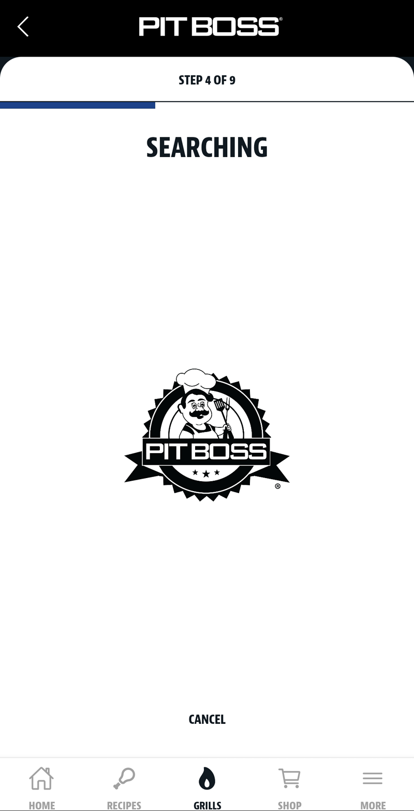 | 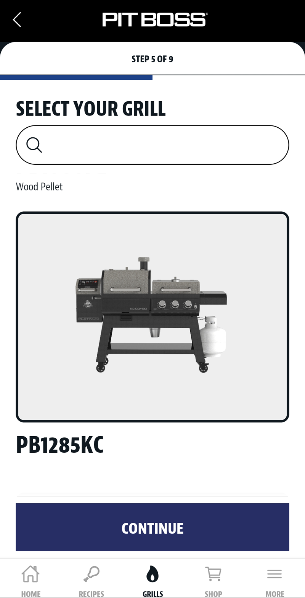 | 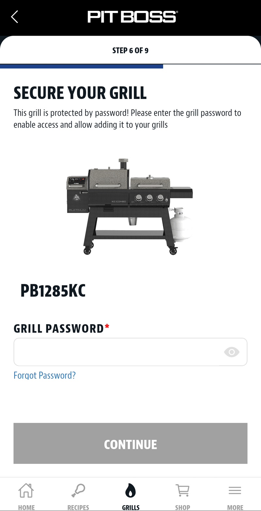 |

| Step 7/9: Select WiFi | Step 8/9: Firmware Update | Step 9/9: Name Your Grill |
| :---: | :---: | :---: |
| 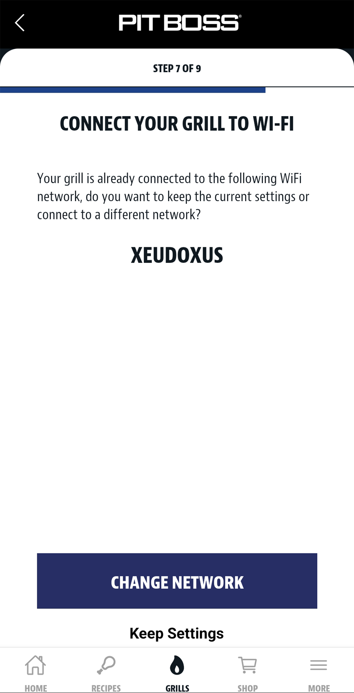 | 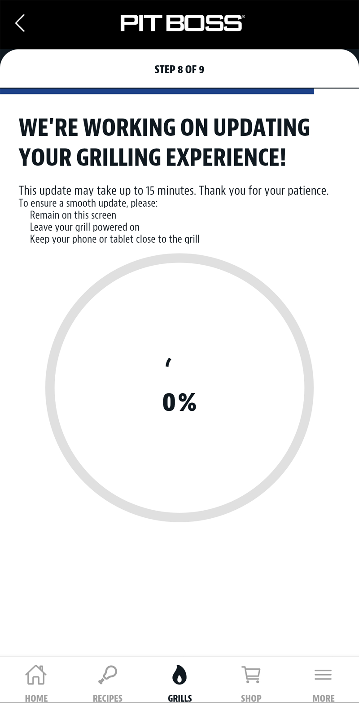 | 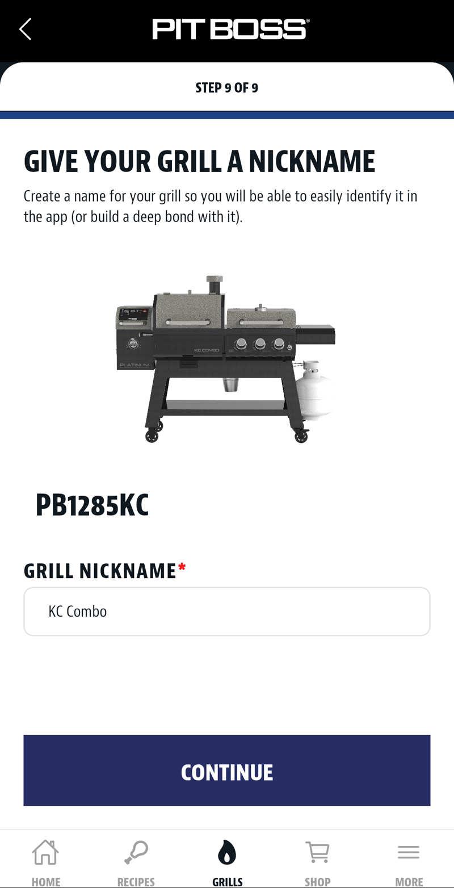 |

</details>

5. **Verify WiFi connection**: The grill should show as "Connected" in the app and display:
   - 🟢 **Solid "iT" icon** → Connected to WiFi
6. **Test connectivity**: Try to adjust the temperature on your grill.
7. **Verify connection**: Your grill should now be connected to the app. (Note: Check for and install any firmware updates for the best performance.)

> ✅ **Setup Complete**: Once your grill is connected to WiFi, you can close the Pit Boss app. It's no longer needed!

---

## Step 2: SmartThings Edge Driver Installation

### Add the Driver Channel
1. **Open SmartThings app** on your phone
2. **Navigate to**: Settings → Device → My Devices
3. **Select your hub**
4. **Tap "Driver"** at the bottom
5. **Tap the "+" icon** to add a channel
6. **Enter the driver channel invitation link** (see README badge / release page)

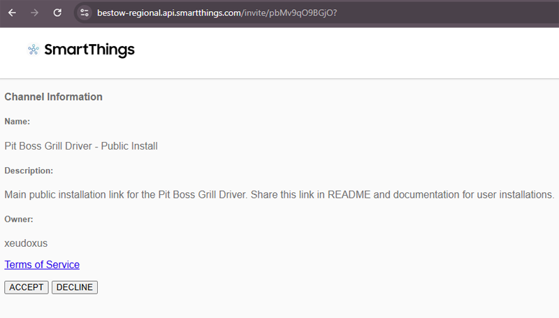

*Adding driver channel in SmartThings app*

### Install the Driver
1. **Find "Pit Boss Grill Driver"** in the available drivers list
2. **Tap "Install"**
3. **Wait for installation** to complete (may take a few minutes)

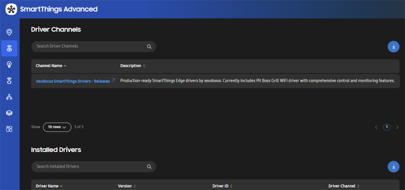

*Driver installation progress in SmartThings*

---

## Step 3: Device Discovery

### Automatic Discovery (Recommended)
1. **Open SmartThings app**
2. **Tap "+" to add device**
3. **Select "Scan for nearby devices"**
4. **Wait for discovery** (may take 30-60 seconds)
5. **Select your Pit Boss grill** from the discovered devices

<details>
<summary>Click to see SmartThings Device Discovery Screenshots</summary>

| Step 1: Add Device | Step 2: Scan for Devices | Step 3: Scanning |
| :---: | :---: | :---: |
| 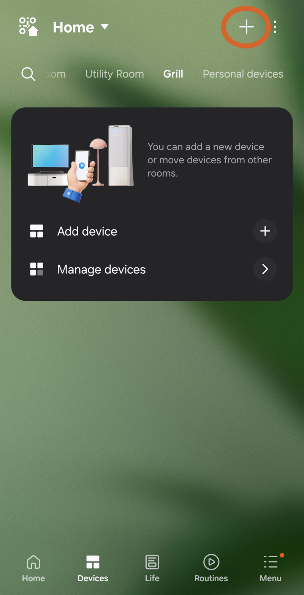 | 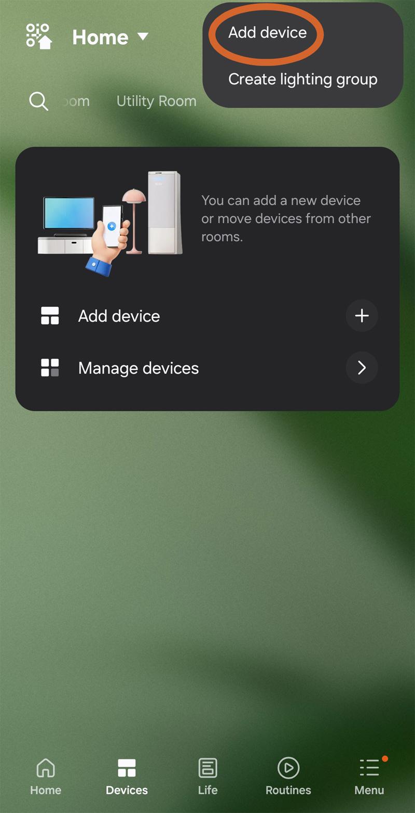 | 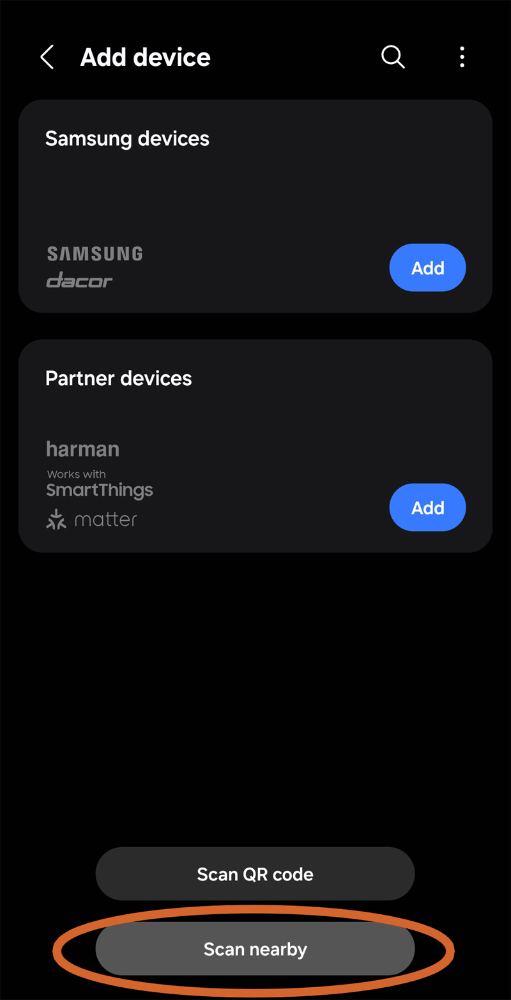 |

| Step 4: Device Found | Step 5: Add Device |
| :---: | :---: |
| 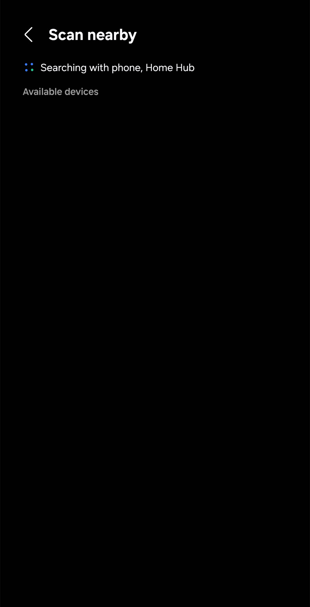 | 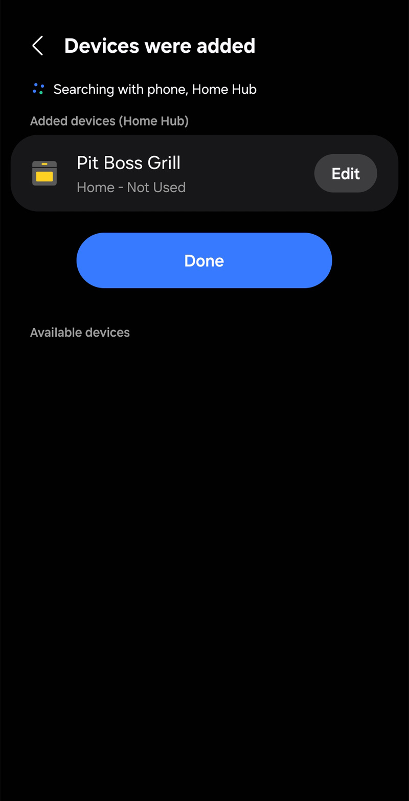 |

</details>

### Manual Configuration (If Auto-Discovery Fails)
1. **Find your grill's IP address**:
   - Check your router's admin panel
   - Use a network scanner app
   - Check the Pit Boss app (if it displays IP info)

2. **Add device manually**:
   - Tap "+" → "Add device" → "By device type"
   - Select "Pit Boss Grill"
   - Enter the IP address in device preferences


*Manual IP address configuration in device preferences*

---

## Step 4: Initial Configuration

### Basic Settings
1. **Open your new Pit Boss device** in SmartThings
2. **Tap the gear icon** (settings)
3. **Configure preferences**:
   - **Refresh Interval**: 30 seconds initially (adjust later)
   - **IP Address**: Auto-detected (switch to reserved static IP for stability)
   - **Temperature Offsets**: Leave at 0 initially (calibrate later)
   - **Auto IP Rediscovery**: Leave disabled unless grill changes IP often; only functions if IP preference left as default (192.168.4.1)

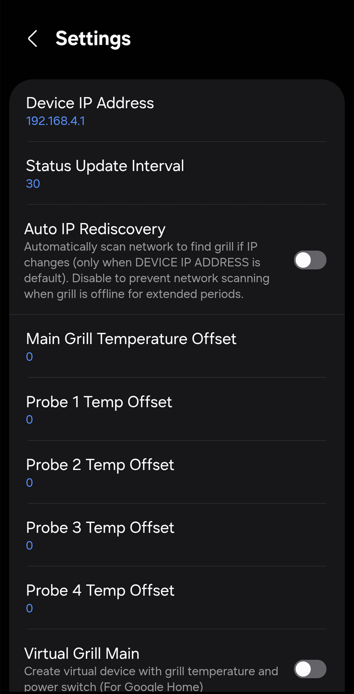

*Device preferences showing refresh interval and temperature offset settings*

### Test Basic Functions
1. **Check temperature readings**: Grill temp should display
2. **Test power control**: Turn grill off via SmartThings
3. **Verify probe readings**: If probes are connected

---

## Step 5: Enable Virtual Devices (Recommended)

> 💡 **Why Virtual Devices?**: Essential for Google Home integration and enhanced SmartThings automations

### Enable Virtual Devices
1. **In device settings**, scroll to "Virtual Device Options"
2. **Enable the devices you want**:
   - ✅ **Virtual Grill Main** (recommended)
   - ✅ **Virtual Grill Light** (if you have interior lights)
   - ✅ **Virtual Grill Probe 1 & 2** (if using probes)
   - ✅ **Virtual Grill Prime** (for pellet priming)
   - ✅ **Virtual Grill At-Temp** (temperature status)
   - ✅ **Virtual Grill Error** (error reporting)

3. **Save settings**
4. **Allow 30–60 seconds** (one status cycle) for virtual devices to appear
5. **If not created**: Toggle preference off/on; verify hub online; check logs

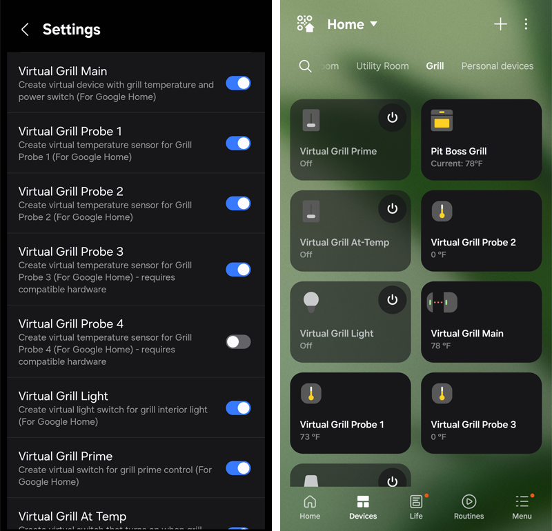

*Virtual device options in preferences and resulting SmartThings devices*

---

## Step 6: Verification

### Complete Functionality Test
- [ ] Grill temperature displays correctly
- [ ] Can turn grill on/off via SmartThings
- [ ] Can set target temperature
- [ ] Probe temperatures display (if connected)
- [ ] Interior light control works (if equipped)
- [ ] Virtual devices appear in SmartThings
- [ ] Status updates regularly

### Troubleshooting Connection Issues
If you're having problems, see the [Troubleshooting](Troubleshooting.md) guide.

---

## Developer Installation (Building from Source)

If you're building the driver from source code, you'll need additional tools:

### Prerequisites
- **SmartThings CLI**: Install and configure (tested with @smartthings/cli/1.10.5)
  ```bash
  npm install -g @smartthings/cli
  ```
- **Node.js**: Required for SmartThings CLI (tested with node-v18.5.0)
- **PowerShell**: Windows PowerShell 5.1 or PowerShell 7+ for cross-platform build script support

### Build Process
1. **Clone the repository**
2. **Copy configuration**: `Copy-Item "local-config.example.json" "local-config.json"`
3. **Update your personal SmartThings IDs** in `local-config.json`
4. **Build and deploy**: `.\build.ps1`

For detailed development instructions, see the main [README.md](../README.md#development--building).

---

## Next Steps

1. **Google Home Integration**: Follow the [Google Home Setup](Google-Home-Setup.md) guide
2. **Fine-tune Settings**: See the [Configuration Guide](Configuration-Guide.md)
3. **Create Automations**: Set up SmartThings routines using your grill

---

## Need Help?
- **Common Issues**: [Troubleshooting](Troubleshooting.md)
- **Model Questions**: [Model Compatibility](Model-Compatibility.md)
- **Report Problems**: [GitHub Issues](https://github.com/xeudoxus/pitboss-grill-driver/issues)

---

## Step 5: Verify Operation
Once the device is configured, it will appear in your SmartThings app. The main device will show the current temperature, setpoint, and provide controls for power and temperature.

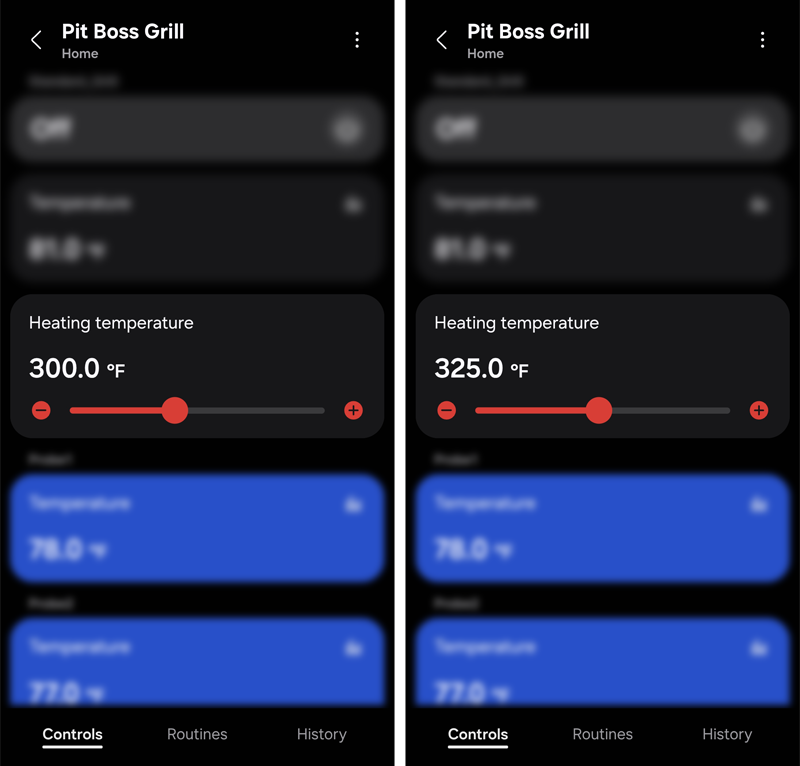

*The main thermostat interface for the Pit Boss grill in the SmartThings app.*