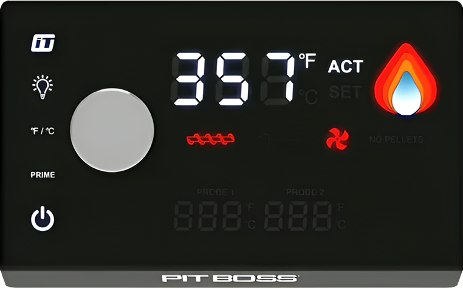
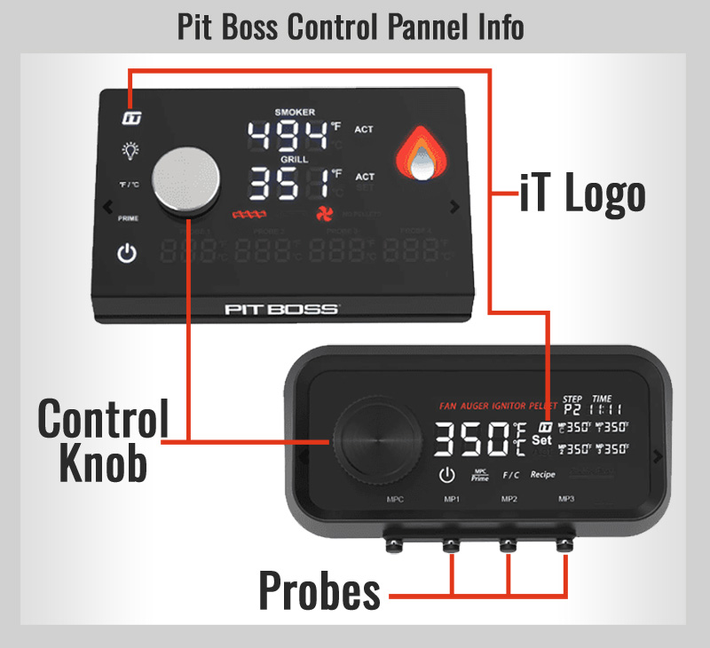
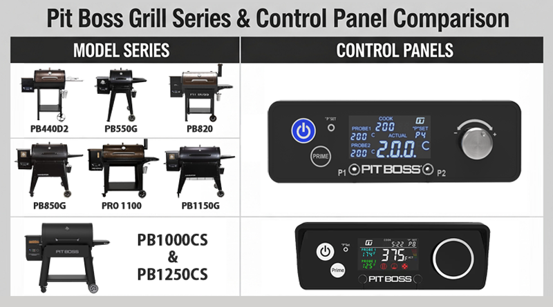
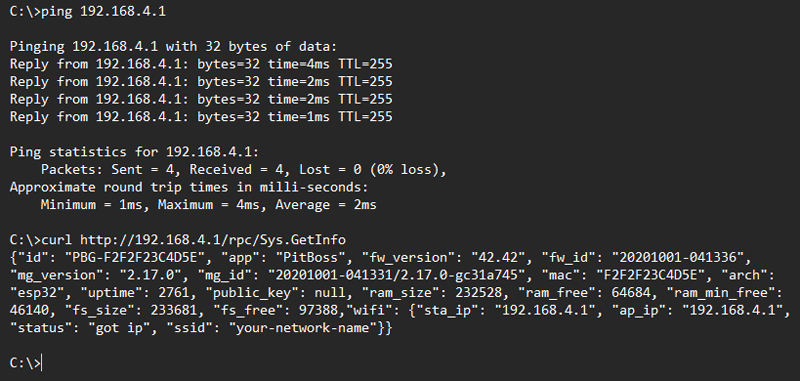
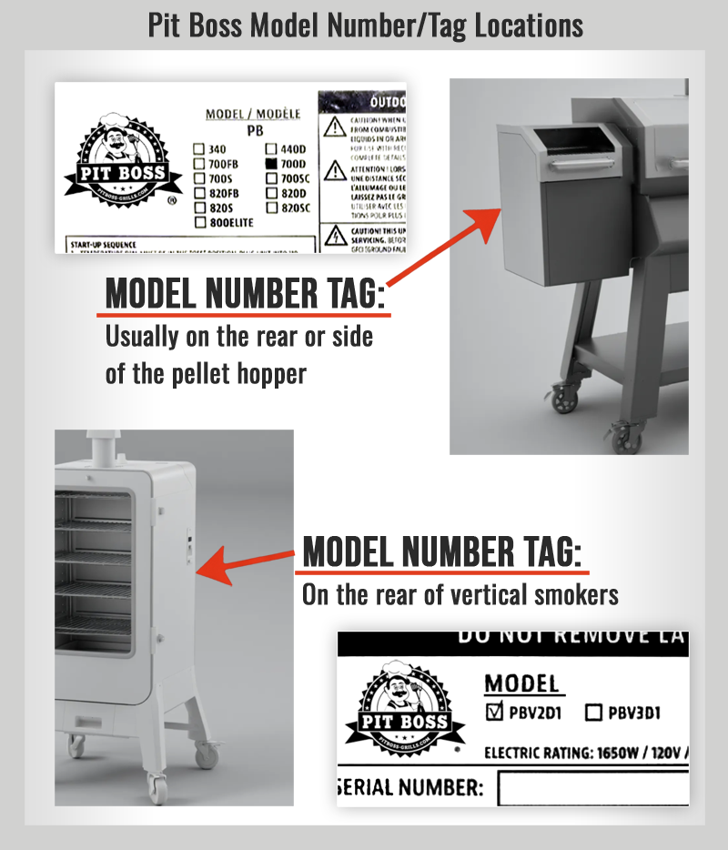

# Model Compatibility Guide

This guide provides detailed information about Pit Boss grill model compatibility, testing results, and how to verify if your specific model will work with this driver.

> ⚠️ **Legal Notice**: This is unofficial third-party software. Pit Boss® and all model names/numbers are trademarks of Dansons Inc. This driver is not endorsed by or affiliated with Pit Boss or Dansons Inc. Use at your own risk.

## Compatibility Overview

The driver was developed and tested specifically on the **Pit Boss PB1285KC (KC Combo)** grill. Compatibility with other models is based on similar control panel designs and WiFi API implementations.



*PB1285KC control panel showing WiFi indicator and display layout*



*Additional control panel configuration found on similar Pit Boss models*

---

## Confirmed Compatible Models

### ✅ Fully Tested and Confirmed
| Model | User Reported | Test Date | Notes |
|-------|---------------|-----------|-------|
| **PB1285KC** | Developer tested | 2025 | ✅ All features working |

*This section will expand as users report successful testing with other models.*

---

## Expected Compatible Models (Unconfirmed)

These models are likely compatible based on similar control panels, WiFi capabilities, and API implementations, but **have not been tested**:

### PB440 Series
- **PB440D3** - WiFi pellet grill
- **PB440D** - Digital control pellet grill  
- **PB440T** - Touch screen model
- **PB456D3** - Digital WiFi model

### PB450 Series  
- **PB450D** - Digital control model
- **PB450T** - Touch screen variant
- **PB450D3** - Digital WiFi model

### PB500 Series
- **PB500T** - Touch screen WiFi model

### PB550 Series
- **PB550G** - WiFi enabled model

### PB700 Series
- **PB700D** - Digital control WiFi
- **PB700T** - Touch screen variant  
- **PB700D3** - Updated digital model
- **PB700** - Base WiFi model

### PB750 Series
- **PB750G** - WiFi enabled model
- **PB750T** - Touch screen variant

### PB820 Series
- **PB820FB** - WiFi with flame broiler
- **PB820FBC** - Combo with flame broiler
- **PB820D3** - Digital WiFi model
- **PB820D** - Digital control variant
- **PB820T** - Touch screen model
- **PB820** - Base WiFi model
- **PB820SC** - WiFi with side cart
- **PB820PS** - Pro series variant

### PB850 Series
- **PB850G** - WiFi enabled model
- **PB850T** - Touch screen variant
- **PB850CS** - With side cart
- **PB850CS3** - Updated cart model

### PB1000 Series
- **PB1000T3** - Touch screen WiFi
- **PB1000SC3** - Side cart model
- **PB1000** - Base WiFi model
- **PB1000T** - Touch screen variant
- **PB1000D** - Digital control model
- **PB1000SP** - Special edition
- **PB1000D3** - Updated digital model
- **PB1000T2** - Touch screen v2
- **PB1000T1** - Touch screen v1
- **PB1000FBC** - Flame broiler combo
- **PB1000SCS** - Side cart special
- **PB1000SC** - With side cart

### PB1150 Series
- **PB1150GS** - WiFi grill and smoker

### PB1230 Series
- **PB1230CSP** - Cart special pro
- **PB1230CS** - With cart system

### PB1250 Series
- **PB1250** - Large capacity WiFi

### PB1270 Series
- **PB1270** - WiFi pellet grill

### PB1285 Series
- **PB1285CS** - Cart system variant
- **PB1285CS2** - Updated cart system (if exists)

### PB1300+ Series (Newer Large Models)
- **PB1300T** - Large touch screen model (if exists)
- **PB1350** - Extra large capacity (if exists)

### PBV Series (Vertical Smokers)
- **PBV2** - Vertical WiFi smoker
- **PBV3** - Updated vertical model
- **PBV4** - Latest vertical model (if exists)

---

## Visual Comparison of Grill Series
This image shows a comparison of different Pit Boss grill series, which may help in identifying your model's family.



---

## Compatibility Requirements

### Essential Requirements
For a Pit Boss grill to be compatible with this driver, it must have:

✅ **WiFi Connectivity** (local LAN access required)  
✅ **HTTP API** (responds to Sys.GetInfo & PB.GetState endpoints)  
✅ **Time-Based Authentication** (firmware ≥ 0.5.7 recommended)  
✅ **Temperature Monitoring** (main chamber sensor functional)  
✅ **Digital Control Interface** (electronic temperature/power control)  

### Highly Recommended Features
These features enhance functionality but aren't required:

🔶 **Multiple Temperature Probes**: For food temperature monitoring  
🔶 **Interior Lighting**: For light control features  
🔶 **Pellet Prime Function**: For pellet system priming  
🔶 **Digital Display**: Better integration with status reporting  

### Likely Incompatible Features
These older grill types are unlikely to work:

❌ **Non-WiFi Models**: No network connectivity  
❌ **Purely Mechanical Controls**: No electronic interfaces  
❌ **Older Bluetooth-Only**: No WiFi API access  
❌ **Third-Party Control Systems**: Non-Pit Boss control electronics  

---

## Testing Your Model

### Pre-Installation Compatibility Check

Before installing the driver, verify your grill meets basic requirements:

#### Step 1: WiFi Connectivity Test
1. **Connect grill to WiFi** using the official Pit Boss Grills app
2. **Note the grill's IP address** - Check your router's DHCP client list. The hostname will be "PBG-{mac address}"
3. **Test basic connectivity**:
   ```bash
   ping [your-grill-ip-address]
   curl http://[your-grill-ip-address]/rpc/Sys.GetInfo
   ```
4. **Expected JSON response** (if compatible):
   ```json
   {
     "id": "PBG-F2F2F23C4D5E",
     "app": "PitBoss", 
     "fw_version": "42.42",
     "fw_id": "20201001-041336",
     "mg_version": "2.17.0",
     "mac": "F2F2F23C4D5E",
     "arch": "esp32",
     "uptime": 1342,
     "ram_size": 232508,
     "ram_free": 63944,
     "wifi": {
       "sta_ip": "192.168.4.1",
       "status": "got ip",
       "ssid": "your-network-name"
     }
   }
   ```
   ✅ **Success**: Grill responds to ping and returns system info JSON
   ❌ **Failure**: No response, connection refused, or non-JSON response




*Network testing commands and results for grill compatibility verification*

#### Step 2: Control Panel Assessment
Compare your grill's control panel to the reference PB1285KC:

**Look for similar features**:
- Digital temperature display
- WiFi status indicator ("iT" icon with these states):
  - 🔁 **Flashing "iT" icon** → Trying to connect to WiFi
  - ⚫ **Off "iT" icon** → Could not connect; will retry later
  - 🟢 **Solid "iT" icon** → Connected to WiFi
- Touch screen or digital buttons
- Power on/off functionality
- Temperature up/down controls

**Document differences**:
- Take photos of your control panel
- Note any unique features or missing elements
- Check model number placement and format

### Post-Installation Testing

After installing the driver, test these functions systematically:

#### Basic Functions Test
- [ ] **Device Discovery**: Grill appears in SmartThings scan
- [ ] **Connection**: Device shows as "online" 
- [ ] **Temperature Reading**: Grill temperature displays correctly
- [ ] **Status Updates**: Information refreshes regularly

#### Control Functions Test  
- [ ] **Power Control**: Can turn grill off via SmartThings
- [ ] **Temperature Setting**: Can set target temperature
- [ ] **Temperature Range**: Test multiple temperature setpoints
- [ ] **Command Response**: Commands execute within reasonable time

#### Advanced Features Test
- [ ] **Probe Monitoring**: Food probe temperatures (if equipped)
- [ ] **Interior Light**: Light control (if equipped)  
- [ ] **Pellet Prime**: Priming function (if equipped)
- [ ] **Status Reporting**: Error detection and status messages

#### Virtual Devices Test
- [ ] **Virtual Device Creation**: Virtual devices appear when enabled
- [ ] **Synchronization**: Virtual devices update with main device
- [ ] **Google Home Import**: Virtual devices sync to Google Home
- [ ] **Voice Commands**: Basic voice control functions work

---

## Reporting Compatibility Results

### Successful Compatibility
If your model works well with the driver, please report success:

**Submit via**: [GitHub Issues](https://github.com/xeudoxus/pitboss-grill-driver/issues) with label "Model Compatibility - Success"

**Include**:
- **Exact model number** and name
- **Control panel photos** (front and side views)
- **Feature test results** (which functions work)
- **Any limitations** or partial functionality
- **Network setup details** (if relevant)

### Compatibility Issues
If your model has problems or doesn't work:

**Submit via**: [GitHub Issues](https://github.com/xeudoxus/pitboss-grill-driver/issues) with label "Model Compatibility - Issue"  

**Include**:
- **Model information**: Number, name, control panel photos
- **Specific symptoms**: What works, what doesn't work
- **Error messages**: Screenshots of any error displays
- **Network details**: IP address, connectivity test results
- **Debug logs**: If available and relevant

### Partial Compatibility
Some models may work partially (e.g., monitoring works but control doesn't):

**Document**:
- **Working features**: Temperature monitoring, status updates, etc.
- **Non-working features**: Power control, temperature setting, etc.
- **Workarounds**: Any manual steps that enable functionality
- **Use case**: Whether partial functionality is still useful

---

## Model Identification Help

### Finding Your Model Number
Pit Boss model numbers are typically located:

1. **Control Panel**: Often printed near the display
2. **Side of Grill**: Metal plate or sticker on exterior
3. **Manual/Packaging**: Documentation that came with grill
4. **Pit Boss App**: May display model info in device settings

### Where to Find Your Model Number
Your grill's model number is typically found on a silver sticker on the back of the hopper or on the inside of the hopper lid.

| Inside Hopper Lid | Back of Hopper |
| :---: | :---: |
|  |  |

*Example locations for your grill's model number sticker.*

### Model Number Format
Pit Boss models typically follow these patterns:
- **PB[size][series]**: e.g., PB1285KC, PB820D3
- **PBV[version]**: Vertical smokers, e.g., PBV2, PBV3
- **Suffixes indicate features**:
  - **D/D3**: Digital control
  - **T**: Touch screen
  - **G**: WiFi enabled
  - **CS**: Cart system
  - **FB/FBC**: Flame broiler
  - **KC**: Combo (grill/smoker)


*Photos showing typical model number locations on Pit Boss grills*

### Control Panel Variations

Different Pit Boss series have distinct control panel designs:

#### Digital Display Models (D/D3 series)
- LED/LCD numeric display
- Physical buttons for control
- WiFi status indicator ("iT" icon):
  - 🔁 **Flashing** → Connecting to WiFi
  - ⚫ **Off** → Connection failed
  - 🟢 **Solid** → Connected to WiFi
- Basic menu system

#### Touch Screen Models (T series)  
- Color touch screen interface
- Swipe and tap controls
- Advanced menu options
- WiFi and status icons ("iT" icon):
  - 🔁 **Flashing** → Connecting to WiFi
  - ⚫ **Off** → Connection failed
  - 🟢 **Solid** → Connected to WiFi

#### Basic WiFi Models (G series)
- Simple digital display
- WiFi connectivity
- Standard button controls
- Status indicator lights ("iT" icon):
  - 🔁 **Flashing** → Connecting to WiFi
  - ⚫ **Off** → Connection failed
  - 🟢 **Solid** → Connected to WiFi

---

## Compatibility Prediction Algorithm

### High Probability Compatible (90%+)
Models with these characteristics are very likely to work:

✅ **Same control panel design** as PB1285KC  
✅ **Digital display** with WiFi/"iT" indicator  
✅ **Released after 2020** with modern WiFi implementation  
✅ **Similar size class** (large pellet grills)  
✅ **Standard Pit Boss branding** and interface  

### Medium Probability Compatible (60-89%)
Models with these characteristics may work with minor issues:

🔶 **Different control panel** but similar digital features  
🔶 **Older models** with WiFi (2018-2020)  
🔶 **Specialty models** (vertical smokers, combos)  
🔶 **Different size class** but same control system  
🔶 **Limited feature set** compared to PB1285KC  

### Low Probability Compatible (30-59%)
Models with these characteristics are less likely to work:

⚠️ **Very old WiFi implementation** (pre-2018)  
⚠️ **Significantly different interface** design  
⚠️ **Budget models** with simplified controls  
⚠️ **Regional variants** with different firmware  
⚠️ **Discontinued models** with limited support  

### Unlikely Compatible (<30%)
Models with these characteristics probably won't work:

❌ **No WiFi connectivity**  
❌ **Bluetooth-only** communication  
❌ **Purely mechanical controls**  
❌ **Third-party control systems**  
❌ **Very old models** (pre-2015)  

---

## Community Compatibility Database

### Current Testing Status

| Model Series | Tested Models | Success Rate | Notes |
|--------------|---------------|--------------|-------|
| **PB1285** | 1/1 | 100% | PB1285KC fully confirmed |
| **PB1000** | 0/11 | TBD | Awaiting user testing |
| **PB820** | 0/7 | TBD | High probability models |
| **PB850** | 0/4 | TBD | Similar to PB820 series |
| **PB700** | 0/4 | TBD | Mid-size models |
| **PBV** | 0/2 | TBD | Vertical smoker variants |
| **Others** | 0/16 | TBD | Various sizes and features |

*Last updated: August 2025 - This table will be updated as users report results*

### Testing Priority List
Models most requested for testing based on popularity and user interest:

1. **PB1000T3** - Popular large touch screen model
2. **PB820D3** - Mid-size digital WiFi model  
3. **PB1285CS** - Cart system version of confirmed working model
4. **PB850T** - Touch screen variant with similar features
5. **PB1000D3** - Updated large digital model
6. **PBV3** - Latest vertical smoker for different form factor testing

**Want to help test?** Submit a [GitHub Issue](https://github.com/xeudoxus/pitboss-grill-driver/issues) with your model number and any test results!

---

## Developer Notes

### API Compatibility Assumptions
The driver makes these assumptions about Pit Boss grill APIs:

- **HTTP communication** on port 80
- **JSON response format** for status queries
- **Standard command structure** for power/temperature control
- **Similar status codes** across models
- **Consistent temperature probe implementation**

### Future Compatibility Work
Planned improvements for broader model support:

- **Auto-detection algorithms** for different API versions
- **Model-specific feature detection** 
- **Graceful degradation** for limited-feature models
- **Configuration profiles** for known model variations
- **Extended testing framework** for community validation

### Contributing Compatibility Data
Developers and advanced users can help expand compatibility:

1. **Network traffic analysis**: Capture API calls from official app
2. **Feature mapping**: Document which features work on which models
3. **Error handling**: Identify model-specific error conditions
4. **Performance testing**: Check resource usage across models